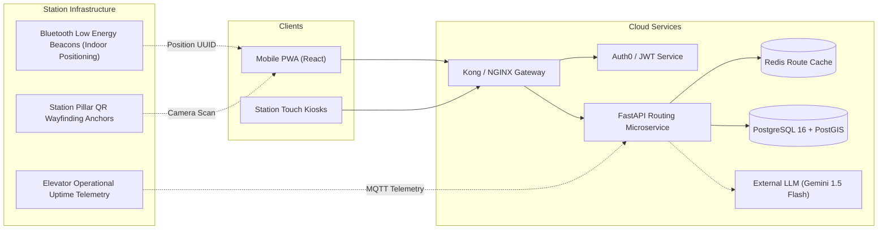

# StationSathi: Comprehensive Technical & Mentoring Guide

> **Official Tagline:** *"Find your way inside the station."*  
> **Document Purpose:** Single authoritative reference for mentors, evaluators, developers, and presentation audiences explaining the complete architecture, data models, multi-station graph navigation engine, feedback moderation system, and codebase of StationSathi.

---

# 1. Project Overview

### Project Name
**StationSathi** (Station Companion / Assistant)

### One-Line Definition
An intelligent, accessibility-aware indoor station assistant for Mumbai Central Railway commuters that provides indoor wayfinding, micro-amenity discovery, and step-free navigation across platforms and foot overbridges.

### Detailed Project Description
StationSathi is a full-stack web application engineered to solve the critical indoor navigation gap in major railway stations across Mumbai's Central Railway network. While standard transit applications (such as Google Maps, m-Indicator, or UTS) provide train timetables, suburban line maps, and GPS-based driving/walking directions to station perimeter gates, their utility abruptly ends at the station threshold.

Inside dense, multi-level interchange terminals like Dadar Central, CSMT, and Thane, thick concrete roofs and steel canopies cause an **indoor GPS blackout**. Satellite signals cannot penetrate the station structure, leaving daily commuters, outstation travelers with heavy luggage, senior citizens, and persons with disabilities (*Divyangjan*) stranded without guidance on how to navigate between multi-tiered platforms, foot overbridges (FOBs), accessible elevators, ramps, ticket counters, washrooms, and micro-amenities like licensed shoe-polishing kiosks.

StationSathi models the **internal physical station environment** using:
1. **Interactive Data-Driven 2D SVG Maps** with pan, zoom, dynamic multi-station geometry, and transparent Map Accuracy indicators (`prototype` vs. `schematic`).
2. **Topological Graph Networks** covering all six major Central Railway stations (126 nodes, 135 edges, 65 verified facilities).
3. **Dijkstra's Algorithm with Weighted Accessibility Constraints** that penalize stairs or strictly eliminate them ($Cost = \infty$) to guarantee step-free paths via elevators and ramps.
4. **A Deterministic Domain NLP Interpreter** with regex platform extraction (Platforms 1–18) and a strict landmark-required distance policy.
5. **A Crowdsourced Feedback & Review Queue System** allowing commuters to report station discrepancies without corrupting verified production datasets.
6. **Dual-Mode Offline Resilience** ensuring 100% functionality even when disconnected from the backend API.

---

### Main Problems Being Solved
1. **Indoor GPS Blackout:** Satellite positioning degrades or fails entirely under dense railway station roofs and concourses.
2. **Accessibility Barriers:** Passengers with mobility challenges, senior citizens, and travelers with heavy luggage struggle to locate working elevators and step-free ramps instead of steep 30-step staircases.
3. **Micro-Amenity Invisibility:** Essential services—such as Divyangjan accessible washrooms, potable water taps, ATVM ticketing kiosks, and licensed shoe-polishing stands—are omitted on consumer navigation maps.
4. **Platform Renumbering Confusion:** Major layout rationalizations (notably Dadar Central's December 2023 renumbering to CR Platforms 8–14 and the decommissioning of former Platform 2) cause severe commuter confusion when relying on obsolete maps or outdated apps.
5. **Data Overclaiming:** Most transit prototypes fabricate fake real-time crowd or positioning data. StationSathi establishes complete provenance transparency through explicit verification badges (`prototype_data`, `publicly_sourced`) and map accuracy tags.

---

### Target Users
- **Daily Suburban Commuters:** Navigating high-footfall interchange hubs like Dadar, Thane, and Ghatkopar during peak rush hours.
- **Divyangjan (Persons with Disabilities) & Senior Citizens:** Requiring strictly step-free elevator and ramp routes across platforms and FOBs.
- **Outstation & Long-Distance Travelers:** Carrying heavy luggage between suburban local platforms and outstation express terminals (e.g., CSMT Buffer Aprons or Dadar Platforms 11–14).
- **Multimodal Commuters:** Interchanging between suburban rail and Mumbai Metro Line 1 at Ghatkopar or the SATIS elevated bus deck at Thane.
- **Tourists & Occasional Visitors:** Needing instant visual orientation within historic heritage terminals like CSMT and Byculla.

---

### Station Coverage Matrix (All 6 Stations)

StationSathi models six core stations comprising the backbone of Mumbai's Central Railway network:

| Station Name | Code | Platforms | Layout Profile | Topological Nodes | Topological Edges | Mapped Facilities | Map Accuracy | Coverage Tier |
| :--- | :---: | :---: | :--- | :---: | :---: | :---: | :---: | :---: |
| **Dadar Central** | `DR` | 7 (CR 8–14) | Multimodal interchange; 3 cross-spanning FOBs; elevator towers | 24 | 32 | 12 | `prototype` | `detailed_prototype` |
| **CSMT** | `CSMT` | 18 (1–18) | UNESCO Heritage Stub Terminus; buffer stop apron concourse | 19 | 19 | 11 | `schematic` | `schematic_navigation` |
| **Byculla** | `BY` | 4 (1–4) | Historic heritage suburban station; central FOB | 19 | 18 | 10 | `schematic` | `schematic_navigation` |
| **Ghatkopar** | `GC` | 4 (1–4) | Multimodal hub; elevated Metro Line 1 link & transfer lift | 20 | 21 | 11 | `schematic` | `schematic_navigation` |
| **Thane** | `TNA` | 10 (1–10) | High-footfall junction; SATIS elevated bus deck & ramp | 23 | 23 | 11 | `schematic` | `schematic_navigation` |
| **Kalyan Junction** | `KYN` | 8 (1–8) | Bifurcating junction; West bus depot concourse & ramp | 21 | 22 | 10 | `schematic` | `schematic_navigation` |
| **Network Total** | — | **51** | — | **126** | **135** | **65** | — | — |

---

### Main Purpose of the Application
To provide a trustworthy, transparent indoor wayfinding system that calculates verifiable walking routes, clearly labels estimated distances and steps, provides turn-by-turn guidance, and highlights accessibility accommodations without inventing unverified real-time railway data.

### What the Project Is NOT
- **Not a Live Train Tracking App:** It does not show live train running status, GPS tracking of rakes, or signal delays (these are served by official systems like NTES or m-Indicator).
- **Not an Official Indian Railways System:** It is an independent engineering and research prototype; it does not claim official endorsement by Indian Railways or Central Railway.
- **Not a Hallucinating Generative Chatbot:** The assistant does not invent nonexistent elevators or guess coordinates; all responses are grounded in verified station JSON datasets.
- **Not a 3D / AR / Heavy GIS Viewer:** It focuses on fast, lightweight 2D SVG vector maps and graph wayfinding that render instantly on low-end mobile devices and mobile browsers without requiring heavy WebGL or external tile downloads.

---

### Current Project Status
- **Overall Completion:** **Production-Ready Demonstration Prototype (100% of planned hackathon scope completed)**.
- **Backend:** 100% functional FastAPI server with Dijkstra routing, domain NLP parser, feedback review queue, and JSON repository.
- **Frontend:** 100% functional React 19 + Vite 8 + Tailwind CSS v4 UI with live SVG map, multi-station geometry rendering, route planner, search, directions panel, developer portal, and demo controller.
- **Station Data:** 6 of 6 stations equipped with topological graphs, renumbered platform coordinates, and verified facilities.
- **Automated Verification:** 
  - `backend/scripts/validate_station_data.py`: **0 Errors, 0 Warnings** across all 126 nodes, 135 edges, and 65 facilities.
  - `backend/tests/test_api.py`: **19 of 19 Pytest automated tests passing** (100% success rate).

---

### Elevator Pitches

#### 30-Second Explanation (For Mentors & Judges)
> "Outdoor navigation stops at the railway station entrance. StationSathi picks up where GPS fails. Focusing on Mumbai Central Railway stations like Dadar, CSMT, and Thane, our app provides a custom 2D SVG map, Dijkstra-powered indoor wayfinding with strict stair-avoidance filters for accessible elevator paths, and natural-language query parsing for finding micro-amenities like washrooms and licensed shoe-polishing stands. It runs on a FastAPI backend with dual-mode offline resilience, crowdsourced feedback moderation, and transparent data verification."

#### 1-Minute Explanation (For Formal Presentations)
> "Mumbai's suburban railway network carries over 7.5 million passengers daily. Yet inside mega-junctions like Dadar Central, finding an accessible elevator or a specific platform across three different foot overbridges is an overwhelming challenge—especially for travelers with heavy luggage, senior citizens, and persons with disabilities. 
> 
> StationSathi is an indoor station companion built specifically for the internal station environment. Using an interactive 2D SVG blueprint and a weighted Dijkstra graph engine covering all six core Central Railway stations (Dadar, CSMT, Byculla, Ghatkopar, Thane, Kalyan), the app calculates exact walking routes based on commuter preferences: shortest path, stair avoidance, or elevator priority. It includes step-by-step turn directions, metric distance and step estimates, a grounded natural-language query assistant, a feedback reporting queue, and transparent data verification tracking so users know exactly what data is verified."

#### Formal Technical Explanation
> "StationSathi is a decoupled client-server web architecture. The backend is built with Python 3.14 and FastAPI, exposing REST endpoints for station metadata, facility queries, Dijkstra pathfinding, user feedback queueing, and domain-specific intent parsing. The routing engine models stations as topological graphs $G=(V, E)$, evaluating route constraints using a weighted edge cost function that penalizes or eliminates stair edges ($Cost = \infty$) to ensure step-free traversal. The frontend is built with React 19, Vite, and Tailwind CSS v4, utilizing raw SVG primitives for 2D mapping with coordinate-based waypoints, dynamic polyline rendering, and viewbox matrix transformations for pan and zoom. Data persistence is decoupled behind a repository pattern currently implemented with structured JSON datasets, validated via automated graph linting scripts, and architected for future relational migration to PostgreSQL and PostGIS."

---

# 2. Problem Statement

### Difficulties Faced Inside Complex Railway Stations
Mumbai suburban railway stations are among the most congested passenger transport hubs in the world. Commuters navigate high-stress, high-density environments where:
1. **Multi-Level Vertical Navigation:** Platforms are accessed via multiple elevated Foot Overbridges (FOBs). Entering an FOB from the wrong staircase forces passengers to walk hundreds of meters against dense passenger currents.
2. **Lack of Step-Free Route Visibility:** Passengers traveling with elderly relatives, wheelchairs, baby strollers, or heavy luggage cannot easily identify which foot overbridges have operational elevators or ramps versus steep 30-step staircases.
3. **Hidden Micro-Amenities:** Micro-services like potable water vending units, station police (RPF) help desks, Divyangjan accessible washrooms, and traditional licensed shoe-polishing kiosks are tucked away beneath stairwells or at platform extremities with no indoor signage.
4. **Dadar Platform Renumbering Realities:** Central Railway executed a major platform renumbering on December 9, 2023 (CR Press Release Ref `CR/BB/2023/12/03`). Central Railway platforms were renumbered from CR 1–6 to CR 8–14 to prevent confusion with Western Railway platforms (WR 1–7). Former CR Platform 2 was decommissioned and physically dismantled to widen Platform 8. Most online blogs and consumer apps still show obsolete platform numbers, misguiding commuters.

### Why Standard Train Apps Do Not Solve This
Consumer transit applications (e.g., Google Maps, Apple Maps, m-Indicator, UTS) excel at:
- Suburban train timetables and schedule frequency
- Outstation PNR status and platform announcement estimates
- Driving or walking directions *to the station perimeter gate*

However, they treat the entire station complex as a single geographic coordinate point. They do not maintain internal concourse floor plans, foot overbridge junction graphs, staircase step counts, elevator shaft coordinates, or platform buffer aprons.

### The Specific Gap Addressed by StationSathi
StationSathi operates **strictly inside the station perimeter**:
- Maps platforms, concourses, and foot overbridges with precise 2D vector geometry.
- Translates physical walking corridors into mathematical graphs with edge distances in meters.
- Applies accessibility cost weighting to route passengers through elevators and ramps rather than stairs.
- Tracks data provenance honestly through verification badges (`prototype_data`, `publicly_sourced`) and map accuracy indicators (`prototype`, `schematic`).
- Provides a crowdsourced issue reporting queue without allowing unmoderated user writes to pollute production maps.

---

# 3. Proposed Solution & Feature Matrix

The table below details every feature in the application, its implementation status, code location, and operational behavior:

| Feature | Status | Where Implemented | Operational Explanation |
|---|---|---|---|
| **Multi-Station Selection** | Implemented | `frontend/src/components/Header.jsx`, `LandingPage.jsx` | Dropdown and station cards allow switching between all 6 stations with explicit coverage badges. |
| **Interactive 2D SVG Map** | Implemented | `frontend/src/components/InteractiveStationMap.jsx` | Custom vector map rendering authentic station layouts (tracks, FOBs, concourses, elevators) with pan/zoom. |
| **Map Accuracy Indicators** | Implemented | `frontend/src/components/InteractiveStationMap.jsx` | Clearly badges map as `prototype` (Dadar surveyed layout) or `schematic` (CSMT, Thane, etc.). |
| **Facility Search & Filtering** | Implemented | `frontend/src/components/FacilitySearch.jsx`, `backend/app/api/facilities.py` | Live text search and category pills (Washrooms, Shoe Polish, Elevators, Tickets, Food, Water, Platforms). |
| **Facility Inspector Card** | Implemented | `frontend/src/components/InteractiveStationMap.jsx` | Clicking any marker opens an inspector card displaying category, level, operational status, and navigation triggers. |
| **Manual Landmark Selection** | Implemented | `frontend/src/components/RoutePlanner.jsx` | *"Select your current landmark"* dropdown with categorized concourses, platforms, and gates, avoiding false indoor GPS claims. |
| **Destination Selection** | Implemented | `frontend/src/components/RoutePlanner.jsx` | Dropdown allowing commuters to select target platforms (8–14 at Dadar, 1–18 at CSMT, etc.), amenities, or exits. |
| **Dijkstra Graph Routing** | Implemented | `backend/app/services/graph_engine.py`, `backend/app/api/navigation.py` | Computes shortest walkable indoor paths across all 6 stations using priority-queue graph relaxation. |
| **Accessibility-Aware Routing** | Implemented | `backend/app/services/graph_engine.py` | Route preferences (*Avoid stairs*, *Prefer elevator*, *Accessible route*) eliminate stair edges ($Cost = \infty$) and route via elevators/ramps. |
| **Turn-by-Turn Directions** | Implemented | `frontend/src/components/DirectionsPanel.jsx` | Step-by-step turn guidance with clearly labeled estimates: distance in meters, stride steps (~0.75m/step), and walk time. |
| **Step-Free Verification Badge** | Implemented | `frontend/src/components/DirectionsPanel.jsx` | Validates whether all traversed edges in the route satisfy `is_accessible == true`. |
| **Natural-Language Assistant** | Implemented | `backend/app/services/nlp_engine.py`, `frontend/src/components/AssistantDrawer.jsx` | Rule-based domain intent classifier parsing queries like *"Reach Platform 10 without stairs"* and *"Where is shoe polish?"*. |
| **Honest Distance Policy** | Implemented | `backend/app/services/nlp_engine.py` | Refuses to calculate "nearest" amenity unless commuter has selected an origin landmark. |
| **Passenger Feedback System** | Implemented | `backend/app/api/feedback.py`, `frontend/src/components/ReportIssueModal.jsx` | Allows passengers to report broken lifts or moved amenities into a moderation queue (`feedback_queue.json`). |
| **Developer Portal** | Implemented | `frontend/src/components/DeveloperPortal.jsx` (`#/demo`) | Dedicated portal with live Swagger links, graph metrics, test launcher, and feedback queue inspector. |
| **Demo Controller & Quick Scenarios**| Implemented | `frontend/src/components/DemoControlPanel.jsx` | Modal with 1-click execution for 9 multi-station scenarios and an instant **Reset State** button. |
| **Data Verification Model** | Implemented | `frontend/src/components/VerificationBadge.jsx`, `backend/app/models/schemas.py` | Tracks `verification_status`, `source_method`, `source_reference`, `last_updated`, and `is_official: false`. |
| **Offline Client Fallback Mode** | Implemented | `frontend/src/data/fallbackData.js`, `frontend/src/services/api.js` | Embedded datasets and precomputed scenario routes that seamlessly activate if the backend API is disconnected. |
| **Automated Graph Validator** | Implemented | `backend/scripts/validate_station_data.py` | Standalone validation script auditing node/edge referential integrity, schemas, and Dadar platform numbering. |
| **A* Navigation Algorithm** | Planned | Documented extension | A* heuristic is identified as a future extension; Dijkstra is the authoritative active algorithm. |
| **PostgreSQL / PostGIS Database** | Planned | Documented in `docs/DATA_MODEL.md` | Active storage uses JSON repository pattern; relational schema and migration DDL are fully specified. |
| **Live Train Arrival Timings** | Excluded | Deliberate design decision | Omitted deliberately to prevent displaying unverified real-time crowd or train data. |
| **3D / AR Map View** | Excluded | Deliberate design decision | Focus remains on fast, reliable, lightweight 2D SVG vector rendering suitable for mobile web. |

---

# 4. Complete Project Architecture

StationSathi follows a **layered, decoupled, service-oriented architecture**:

```mermaid
flowchart TB
    subgraph ClientLayer ["Client Presentation Layer (React 19 + Vite 8 + Tailwind v4)"]
        UI["App.jsx (Root State & View Routing)"]
        Header["Header.jsx (Station Switcher & Live Status)"]
        Map["InteractiveStationMap.jsx (2D SVG Canvas, Multi-Station Geometry)"]
        Planner["RoutePlanner.jsx (Landmark Origin & Destination)"]
        Directions["DirectionsPanel.jsx (Turn Guidance & Metric Estimates)"]
        Search["FacilitySearch.jsx (Keyword & Category Filters)"]
        Assistant["AssistantDrawer.jsx (NLP Query Interface)"]
        DemoCtrl["DemoControlPanel.jsx (Multi-Station Scenario Launcher)"]
        DevPortal["DeveloperPortal.jsx (System Telemetry & Feedback Queue)"]
        FeedbackModal["ReportIssueModal.jsx (Passenger Issue Reporting)"]
        ClientFallback["fallbackData.js (Resilient Offline Fallback Engine)"]
    end

    subgraph APILayer ["FastAPI REST Gateway (Port 8000)"]
        HealthRoute["GET /api/health"]
        StationRoutes["GET /api/stations\nGET /api/stations/{id}\nGET /api/stations/{id}/graph"]
        FacilityRoutes["GET /api/stations/{id}/facilities\nGET /api/stations/{id}/facilities/{fid}"]
        NavRoutes["POST /api/navigation/route"]
        AssistantRoutes["POST /api/assistant/query"]
        FeedbackRoutes["POST /api/feedback\nGET /api/feedback/queue"]
    end

    subgraph ServiceLayer ["Backend Core Services Layer"]
        NavEngine["NavigationEngine (graph_engine.py)\n• Multi-Station Dijkstra Pathfinding\n• Weighted Accessibility Cost Model\n• Metric Step & Direction Formatter"]
        NLPEngine["DomainNLPEngine (nlp_engine.py)\n• Multi-Station Intent Classifier\n• Regex Platform Extractor (1–18)\n• Nearest Facility Graph Evaluator"]
        RepoInterface["StationRepository (Abstract Base Class)"]
    end

    subgraph StorageLayer ["Data Storage & Verification Layer"]
        JsonRepo["JsonStationRepository (data_repository.py)"]
        DataFiles["backend/app/data/*.json\n• stations.json\n• facilities_*.json (6 stations)\n• graph_*.json (6 stations)\n• feedback_queue.json"]
        PostgresPlan["PostgreSQL 16 + PostGIS (Documented Migration Target)"]
    end

    %% Client Layer Connections
    UI --> Header
    UI --> Map
    UI --> Planner
    UI --> Directions
    UI --> Search
    UI --> Assistant
    UI --> DemoCtrl
    UI --> DevPortal
    UI --> FeedbackModal

    %% API Calls
    Planner -->|POST /api/navigation/route| NavRoutes
    Search -->|GET /api/stations/{id}/facilities| FacilityRoutes
    Assistant -->|POST /api/assistant/query| AssistantRoutes
    Header -->|GET /api/stations| StationRoutes
    Header -->|GET /api/health| HealthRoute
    FeedbackModal -->|POST /api/feedback| FeedbackRoutes
    DevPortal -->|GET /api/feedback/queue| FeedbackRoutes

    %% Offline Fallback Intercept
    Planner -.->|Backend Offline| ClientFallback
    Search -.->|Backend Offline| ClientFallback
    Assistant -.->|Backend Offline| ClientFallback

    %% Gateway to Services
    NavRoutes --> NavEngine
    AssistantRoutes --> NLPEngine
    StationRoutes --> RepoInterface
    FacilityRoutes --> RepoInterface
    FeedbackRoutes --> DataFiles

    %% Services to Repository
    NavEngine --> RepoInterface
    NLPEngine --> RepoInterface
    NLPEngine --> NavEngine
    RepoInterface --> JsonRepo
    JsonRepo --> DataFiles
    RepoInterface -.-> PostgresPlan
```

### Component Relationships
1. **Frontend to Backend:** The React client communicates with FastAPI over HTTP using `fetch` wrappers defined in `frontend/src/services/api.js`. In local development, the Vite dev server (`localhost:5173`) proxies `/api` requests to `127.0.0.1:8000`.
2. **Backend API to Services:** Route controllers in `backend/app/api/` parse request bodies using Pydantic models, delegating routing to `NavigationEngine`, query parsing to `DomainNLPEngine`, and feedback storage to `feedback.py`.
3. **Multi-Station Graph Repository:** `JsonStationRepository` dynamically loads graph nodes and edges for any requested station from `graph_<station_id>.json` and caches them in memory.
4. **Resilience & Offline Fallback:** If the backend is disconnected, `frontend/src/services/api.js` catches the fetch error and transparently returns fallback data from `frontend/src/data/fallbackData.js`, updating the status badge to **Prototype Mode**.
5. **Feedback Isolation:** Passenger issue reports submitted via `ReportIssueModal.jsx` are written to `feedback_queue.json` in a separate review queue. Verified station datasets are never modified automatically by end-user requests.

---

# 5. Complete Folder and File Explorer Guide

```
StationSathi/
├── .env.example                     # Environment variable template
├── .gitignore                       # Git ignore rules (node_modules, pycache, envs)
├── Myworking.md                     # Operational guide & development history
├── README.md                        # Primary public documentation
├── Station_Sathi.md                 # Complete technical & mentoring guide (This Document)
├── backend/                         # Python FastAPI backend application
│   ├── requirements.txt             # Python dependencies (fastapi, uvicorn, pydantic, pytest)
│   ├── app/
│   │   ├── __init__.py
│   │   ├── main.py                  # FastAPI application entrypoint, CORS & router inclusion
│   │   ├── api/                     # REST API route controllers
│   │   │   ├── __init__.py
│   │   │   ├── assistant.py         # Natural-language query endpoint
│   │   │   ├── facilities.py        # Facility search & retrieval endpoints
│   │   │   ├── feedback.py          # Crowdsourced feedback queue endpoints
│   │   │   ├── navigation.py        # Route calculation endpoint
│   │   │   └── stations.py          # Station listing and graph endpoints
│   │   ├── data/                    # Authoritative station datasets
│   │   │   ├── facilities_byculla.json    # 10 facilities for Byculla
│   │   │   ├── facilities_csmt.json       # 11 facilities for CSMT
│   │   │   ├── facilities_dadar.json      # 12 renumbered facilities for Dadar
│   │   │   ├── facilities_ghatkopar.json  # 11 facilities for Ghatkopar
│   │   │   ├── facilities_kalyan.json     # 10 facilities for Kalyan
│   │   │   ├── facilities_thane.json      # 11 facilities for Thane
│   │   │   ├── feedback_queue.json        # Moderated passenger report queue
│   │   │   ├── graph_byculla.json         # 19 nodes & 18 edges for Byculla
│   │   │   ├── graph_csmt.json            # 19 nodes & 19 edges for CSMT
│   │   │   ├── graph_dadar.json           # 24 nodes & 32 edges for Dadar Central
│   │   │   ├── graph_ghatkopar.json       # 20 nodes & 21 edges for Ghatkopar
│   │   │   ├── graph_kalyan.json          # 21 nodes & 22 edges for Kalyan
│   │   │   ├── graph_thane.json           # 23 nodes & 23 edges for Thane
│   │   │   ├── stations.json              # 6 station metadata definitions
│   │   │   └── raw/                       # Source audit manifests per station
│   │   │       ├── byculla/source_manifest.json
│   │   │       ├── csmt/source_manifest.json
│   │   │       ├── dadar/source_manifest.json
│   │   │       ├── ghatkopar/source_manifest.json
│   │   │       ├── kalyan/source_manifest.json
│   │   │       └── thane/source_manifest.json
│   │   ├── models/                  # Pydantic data schemas
│   │   │   ├── __init__.py
│   │   │   └── schemas.py           # Station, Facility, Node, Edge, Route, Feedback schemas
│   │   └── services/                # Core business logic
│   │       ├── __init__.py
│   │       ├── data_repository.py   # Abstract repository & dynamic multi-station JSON loader
│   │       ├── graph_engine.py      # Multi-station Dijkstra pathfinding & turn directions
│   │       └── nlp_engine.py        # Intent parser, regex platform extractor & nearest lookup
│   ├── scripts/                     # Data validation & management scripts
│   │   ├── generate_fallback_data.py # Compiles backend JSONs into frontend fallbackData.js
│   │   ├── ingest_data.py           # Data ingestion helper
│   │   └── validate_station_data.py # Automated integrity & schema validation suite
│   └── tests/
│       └── test_api.py              # 19 automated Pytest unit tests
├── docs/                            # In-depth architectural & verification documentation
│   ├── API_DOCUMENTATION.md         # Full REST API contracts & sample JSON payloads
│   ├── ARCHITECTURE.md              # Technical design, cost formulas & system diagrams
│   ├── DADAR_DATA_MIGRATION.md      # Dadar platform renumbering migration report
│   ├── DATA_MODEL.md                # Data dictionary & PostgreSQL/PostGIS DDL
│   ├── DEMO_SCRIPT.md               # 5–7 minute live presentation script
│   ├── FIELD_SURVEY_TEMPLATE.md     # On-site station audit protocol
│   ├── IMPLEMENTATION_COMPLETION_REPORT.md # 22-item engineering completion report
│   ├── STATION_COVERAGE.md          # Multi-station roadmap & platform matrix
│   ├── STATION_DATA_AUDIT.md        # Audit logs for all 6 stations
│   ├── STATION_DATA_SOURCES.md      # Authoritative source register
│   └── VALIDATION_REPORT.md         # Automated test and validation outputs
└── frontend/                        # React Vite frontend application
    ├── index.html                   # HTML entry with transit metadata & favicon
    ├── package.json                 # Node dependencies & build scripts
    ├── vite.config.js               # Vite config with Tailwind v4 & API proxy
    ├── public/
    │   ├── favicon.svg              # Railway icon asset
    │   ├── platform_rain.jpg        # Public transit hero image
    │   └── station_hero.png         # High-resolution station hero banner
    └── src/
        ├── App.jsx                  # Root React application orchestrator
        ├── index.css                # Tailwind CSS v4 directives & keyframe animations
        ├── main.jsx                 # React DOM root renderer
        ├── components/
        │   ├── AssistantDrawer.jsx       # NLP query drawer & intent breakdown
        │   ├── BasicStationView.jsx      # Station directory overview card
        │   ├── DemoControlPanel.jsx      # Multi-station scenario launcher & reset button
        │   ├── DeveloperPortal.jsx       # System telemetry, metrics, API docs & feedback queue
        │   ├── DirectionsPanel.jsx       # Turn-by-turn guidance card & step estimates
        │   ├── FacilitySearch.jsx        # Search input & category filter pills
        │   ├── Header.jsx                # Top bar, station switcher, live backend status
        │   ├── InteractiveStationMap.jsx # Custom 2D SVG canvas with multi-station geometry
        │   ├── LandingPage.jsx           # Public transit marketing landing page
        │   ├── ReportIssueModal.jsx      # Commuter feedback & discrepancy reporting modal
        │   ├── RoutePlanner.jsx          # Landmark origin & destination selectors
        │   ├── StationDashboard.jsx      # Main transit workspace orchestrator
        │   ├── StationInfoModal.jsx      # Metadata, provenance & ethics modal
        │   └── VerificationBadge.jsx     # Color-coded verification status badge
        ├── data/
        │   └── fallbackData.js      # Complete offline mirror for all 6 stations
        └── services/
            └── api.js               # Client API wrapper with automatic offline fallback
```

---

### Detailed File-by-File Reference

| Path | Type | Purpose | Key Responsibilities & Functions |
|---|---|---|---|
| `backend/app/main.py` | Python Script | FastAPI entrypoint | Configures CORS, mounts `/api` routers, exposes `/api/health`. |
| `backend/app/models/schemas.py` | Pydantic Models | Data typing & validation | Defines `Station`, `Facility`, `GraphNode`, `GraphEdge`, `RouteRequest`, `RouteResponse`, `UserFeedbackReport`. |
| `backend/app/api/stations.py` | API Router | Station metadata & graphs | `GET /api/stations`, `GET /api/stations/{id}`, `GET /api/stations/{id}/graph`. |
| `backend/app/api/facilities.py` | API Router | Amenity endpoints | `GET /api/stations/{id}/facilities` with category and search query filtering. |
| `backend/app/api/navigation.py` | API Router | Routing endpoint | `POST /api/navigation/route` invoking Dijkstra graph calculations. |
| `backend/app/api/assistant.py` | API Router | Query assistant endpoint | `POST /api/assistant/query` delegating to `DomainNLPEngine`. |
| `backend/app/api/feedback.py` | API Router | Moderation queue endpoints| `POST /api/feedback`, `GET /api/feedback/queue`. |
| `backend/app/services/graph_engine.py` | Service | Pathfinding engine | Implements `NavigationEngine`, priority-queue Dijkstra, stair elimination, and turn directions. |
| `backend/app/services/nlp_engine.py` | Service | Query parser | Implements `DomainNLPEngine`, regex platform matching (1–18), intent classification, nearest lookup. |
| `backend/app/services/data_repository.py` | Service | Data access layer | Implements `JsonStationRepository` with dynamic graph and facility file loading. |
| `backend/scripts/validate_station_data.py` | Python Script | Quality auditing | Audits all 6 station graphs, node references, schemas, and Dadar platform numbers. |
| `backend/scripts/generate_fallback_data.py`| Python Script | Offline synchronizer | Exports backend JSON files into `frontend/src/data/fallbackData.js`. |
| `backend/tests/test_api.py` | Pytest Suite | Automated tests | 19 tests verifying API endpoints, Dadar renumbering, Dijkstra routes, accessibility, and feedback. |
| `frontend/src/App.jsx` | React Component | Root orchestrator | Manages view states (`landing`, `dashboard`, `demo`), current station, modals, and scenario events. |
| `frontend/src/components/InteractiveStationMap.jsx` | React Component | 2D SVG canvas | Renders station tracks, concourses, FOBs, elevator shafts, markers, and animated route lines. |
| `frontend/src/components/DeveloperPortal.jsx` | React Component | Telemetry portal | Displays system health, API endpoints, graph telemetry, feedback queue, and test launcher. |
| `frontend/src/components/ReportIssueModal.jsx` | React Component | Passenger feedback | Form for reporting broken elevators, moved kiosks, or incorrect signage to `/api/feedback`. |
| `frontend/src/components/DemoControlPanel.jsx` | React Component | Demo launcher | 1-click execution for 9 multi-station evaluation scenarios and **Reset Demo State** button. |
| `frontend/src/data/fallbackData.js` | JS Module | Offline mirror | Contains embedded datasets and precomputed routes for all 6 stations. |

---

## Files to Show Manually During a Presentation

| Priority | File to Open | What It Proves | What You Should Say to the Mentor |
|---|---|---|---|
| **1** | `backend/app/services/graph_engine.py` | Authentic Dijkstra pathfinding with accessibility pruning | *"Here is our core routing engine. Notice it does not use hardcoded paths. When 'Avoid stairs' is selected, stair edges are pruned with infinite cost so commuters are routed strictly through elevators and ramps."* |
| **2** | `backend/app/data/graph_dadar.json` | Authentic station topology with post-2023 platform numbers | *"This file defines Dadar's physical graph. Notice the platforms are numbered 8 to 14 in compliance with Central Railway's official December 2023 renumbering, and former Platform 2 is completely decommissioned."* |
| **3** | `frontend/src/components/InteractiveStationMap.jsx` | Data-driven multi-station SVG rendering pipeline | *"We avoided heavy third-party map tiles. This custom SVG canvas renders custom geometries for Dadar, CSMT, Thane, etc., with transparent Map Accuracy badges and animated route polylines."* |
| **4** | `backend/scripts/validate_station_data.py` | Automated data integrity & referential consistency | *"We run an automated data audit script that validates schema compliance, referential integrity of all 135 edges, and verified node IDs across all six stations with zero errors."* |
| **5** | `backend/tests/test_api.py` | 19 automated unit tests | *"We maintain 19 automated Pytest tests validating multi-station routing, Dadar platform rationalization, stair-avoidance routing, NLP parsing, and feedback queueing."* |
| **6** | `backend/app/api/feedback.py` | Crowdsourced issue reporting with moderation protection | *"Passenger reports never modify our verified production data directly. They are appended to a moderated feedback queue for field audit verification."* |

---

# 6. Technology Stack

### Frontend Stack
- **JavaScript (ES6+) / JSX:** Primary language for user interface and client logic.
- **React.js (v19.2.8):** Modern component-based view library utilizing functional components and hooks (`useState`, `useEffect`, `useRef`).
- **Vite (v8.3.0):** Next-generation build tool and development server providing sub-second Hot Module Replacement (HMR).
- **Tailwind CSS (v4.3.3) & `@tailwindcss/vite`:** Modern utility-first CSS engine for responsive public-transport styling.
- **Lucide React (v1.46.0):** Clean, accessible SVG iconography for transit symbols (trains, elevators, stairs, washrooms, compasses).
- **Custom SVG Engine:** Data-driven vector rendering for 2D station maps without third-party mapping dependencies.

### Backend Stack
- **Python (v3.14.7):** Core language for API services, graph algorithms, and data structures.
- **FastAPI (v0.141.1):** High-performance asynchronous web framework for building REST APIs with automatic OpenAPI/Swagger generation.
- **Starlette (v1.6.0):** Underlying ASGI framework powering FastAPI's routing and CORS middleware.
- **Uvicorn (v0.53.0):** Production-grade ASGI web server running the Python backend.
- **Pydantic (v2.13.5) & Pydantic-Core (v2.46.5):** Robust data validation, serialization, and type enforcement.
- **Pytest (v9.1.1) & HTTPX (v0.28.1):** Automated testing framework and synchronous test client.

### Database & Storage Architecture
- **Current Active Persistence:** **Structured JSON Repository** located in `backend/app/data/*.json`.
- **Architectural Abstraction:** Abstract Base Class `StationRepository` in `data_repository.py`.
- **Feedback Storage:** Moderated JSON queue in `backend/app/data/feedback_queue.json`.
- **Planned Target Persistence:** PostgreSQL 16 with PostGIS spatial extensions (detailed in `docs/DATA_MODEL.md`).

---

### Technology Justification Table

| Technology | Category | Where Used | Purpose | What to Say in Presentation |
|---|---|---|---|---|
| **React 19** | Frontend Framework | `frontend/src/` | Interactive state management and UI modularity | *"React manages reactive state across the map, search filters, route planner, and developer portal without page reloads."* |
| **Tailwind CSS v4** | UI Styling | `frontend/src/index.css` | High-contrast public-transport aesthetic | *"Provides clean, accessible transit styling following railway color conventions (navy, slate, emerald, amber)."* |
| **SVG Primitives** | Map Rendering | `InteractiveStationMap.jsx` | Lightweight vector indoor station map | *"We use pure SVG vectors for our map. It requires zero external map tiles, loads in milliseconds, and supports seamless vector zoom."* |
| **FastAPI** | Backend Framework | `backend/app/` | REST API service and route controllers | *"FastAPI gives us asynchronous performance, strict Pydantic type validation, and auto-generated Swagger docs."* |
| **Python `heapq`** | Algorithm Service | `graph_engine.py` | Priority-queue Dijkstra pathfinding | *"Dijkstra's algorithm runs in $O((V + E) \log V)$ time using Python's standard `heapq`, ensuring sub-millisecond route generation."* |
| **Structured JSON** | Data Storage | `backend/app/data/` | Prototype data repository | *"JSON files provide deterministic, zero-configuration data storage ideal for field surveys and git-based audit tracking."* |
| **Repository Pattern**| Software Design | `data_repository.py` | Decoupling data access from API routes | *"The data layer is decoupled behind an abstract repository, making future migration to PostgreSQL transparent to our API."* |

---

# 7. Database and Data Storage Explanation

### Comprehensive Data Architecture Q&A

1. **Is the project using a real database?**  
   The prototype currently uses a **structured JSON file repository** wrapped inside an abstract repository layer (`StationRepository`). It does not run a separate database daemon like PostgreSQL or MongoDB during local evaluation.
2. **Why is JSON suitable for the prototype?**  
   Station topologies and facility locations are relatively static. JSON allows zero-latency local development, portable Git version control of surveyed station layouts, and runs without setting up external database servers or Docker containers during evaluation.
3. **Where are the authoritative data files located?**  
   All authoritative data files are stored in `backend/app/data/`:
   - `stations.json` (6 stations metadata)
   - `graph_*.json` (6 topological graphs: `dadar`, `csmt`, `byculla`, `ghatkopar`, `thane`, `kalyan`)
   - `facilities_*.json` (6 facility registries)
   - `feedback_queue.json` (moderated user reports)
   - `raw/<station>/source_manifest.json` (data source audit manifests)
4. **What information is stored for each station?**  
   Station IDs, official names, railway codes, zones, divisions, descriptions, platform counts, platform renumbering notes, entrances, exits, facility summaries, confidence levels, verification statuses, source references, and last-updated timestamps.
5. **How are graph nodes stored?**  
   In `backend/app/data/graph_<station_id>.json` under the `"nodes"` dictionary keyed by unique `node_id`. Each node records its physical landmark name, type, SVG canvas coordinates (`x`, `y`), and floor level.
6. **How are graph edges stored?**  
   In `backend/app/data/graph_<station_id>.json` under the `"edges"` array, specifying `from_node`, `to_node`, `distance_m`, `edge_type` (`"walkway"`, `"stairs"`, `"elevator"`, `"ramp"`, `"fob"`), and `is_accessible`.
7. **How are routes stored or calculated?**  
   Routes are **not hardcoded**. They are calculated **dynamically in real time** by `NavigationEngine` using Dijkstra's algorithm over the graph nodes and edges.
8. **How are verification status and update dates stored?**  
   Every station and facility record contains explicit fields: `"verification_status"` (`"prototype_data"`, `"publicly_sourced"`), `"is_official": false`, `"source_reference"`, and `"last_updated": "2026-09-19"`.
9. **How does the frontend retrieve the information?**  
   Via asynchronous HTTP GET requests using `fetch()` in `frontend/src/services/api.js`.
10. **How does the backend retrieve the information?**  
    `JsonStationRepository` reads and parses the JSON files into typed Pydantic models upon startup and caches them in memory.
11. **Which API endpoints return the information?**  
    - `GET /api/stations` — All 6 stations
    - `GET /api/stations/{id}` — Single station
    - `GET /api/stations/{id}/facilities` — Facilities list with category/search filters
    - `GET /api/stations/{id}/graph` — Walkable topological graph
12. **How can I add a new facility record?**  
    Add a JSON object to `backend/app/data/facilities_<station_id>.json` with a unique `facility_id`, category, floor level, SVG coordinates, and an existing `node_id`. Run `python backend/scripts/validate_station_data.py` to confirm referential integrity.
13. **How does the crowdsourced feedback system work?**  
    Passengers submit issue reports via `POST /api/feedback`. The server validates the report and appends it to `backend/app/data/feedback_queue.json` with status `"pending_review"`. Verified station datasets are never modified directly.
14. **What happens if the backend is down?**  
    The frontend catches the connection error and loads local fallback data from `frontend/src/data/fallbackData.js`, displaying the discreet badge **Prototype Mode**.

---

# 8. Database Schema and Data Dictionary

### 1. `Station` Entity (`backend/app/models/schemas.py`)

| Field | Type | Required? | Purpose | Example |
|---|---|---|---|---|
| `station_id` | `str` | Yes | Unique URL-safe identifier | `"dadar"`, `"csmt"`, `"thane"` |
| `name` | `str` | Yes | Official station display name | `"Dadar Central"` |
| `code` | `str` | Yes | Indian Railways station code | `"DR"`, `"CSMT"`, `"TNA"` |
| `network` | `str` | Yes | Operating network | `"Central Railway"` |
| `station_type` | `str` | Optional | Architectural classification | `"Multimodal Interchange Hub"` |
| `description` | `str` | Yes | Operational summary | `"Critical multimodal interchange..."` |
| `coverage` | `str` | Yes | Coverage tier identifier | `"detailed_prototype"`, `"schematic_navigation"` |
| `coverage_label`| `str` | Yes | Human-readable badge text | `"Detailed navigation prototype"` |
| `map_type` | `str` | Yes | Map rendering engine | `"interactive_svg"` |
| `map_accuracy` | `str` | Yes | Cartographic accuracy tier | `"prototype"`, `"schematic"` |
| `platforms_count`| `int`| Yes | Total operational platforms | `7` (Dadar CR), `18` (CSMT) |
| `platform_information` | `str` | Optional | Specific renumbering context | `"CR platforms 8 to 14 effective Dec 2023..."` |
| `entrances` | `List[str]` | Yes | Verified external gates | `["East Entrance (Dadar TT)"]` |
| `exits` | `List[str]` | Optional | Verified egress points | `["East Exit (Dadar TT Circle)"]` |
| `facilities_summary`| `List[str]`| Yes | Key amenities overview | `["Central Accessible Elevators"]` |
| `confidence_level` | `str` | Optional | Data audit confidence | `"high"`, `"medium"` |
| `verification_status`| `str`| Yes | Provenance tier | `"prototype_data"`, `"publicly_sourced"` |
| `is_official` | `bool` | Yes | Official railway endorsement flag | `False` |
| `source_method` | `str` | Yes | Provenance methodology | `"Central Railway station layout notice"` |
| `source_reference` | `str` | Optional | Audit citation | `"Central Railway Press Release CR/BB/2023/12/03"` |
| `source_access_date` | `str` | Optional | Audit retrieval date | `"2026-09-19"` |
| `last_updated` | `str` | Yes | ISO date string | `"2026-09-19"` |

---

### 2. `Facility` Entity (`backend/app/models/schemas.py`)

| Field | Type | Required? | Purpose | Example |
|---|---|---|---|---|
| `facility_id` | `str` | Yes | Unique facility primary key | `"dadar_shoepolish_01"` |
| `station_id` | `str` | Yes | Foreign key to `Station` | `"dadar"` |
| `station_name` | `str` | Yes | Denormalized station name | `"Dadar Central"` |
| `station_code` | `str` | Yes | Railway station code | `"DR"` |
| `name` | `str` | Yes | Amenity display title | `"Shoe-Polishing Kiosk (East Concourse)"` |
| `category` | `str` | Yes | Standardized amenity category | `"shoepolish"`, `"washroom"`, `"elevator"`, `"ticket_counter"`, `"drinking_water"` |
| `floor_level` | `str` | Yes | Station elevation layer | `"Ground Concourse"`, `"FOB Level 1"` |
| `svg_coords` | `Dict[str, float]` | Optional | (x, y) canvas placement | `{"x": 820.0, "y": 290.0}` |
| `node_id` | `str` | Optional | Foreign key to `GraphNode` | `"node_shoepolish_east"` |
| `availability_status`| `str` | Yes | Operational condition | `"operational"` |
| `verification_status`| `str` | Yes | Data audit tier | `"prototype_data"`, `"publicly_sourced"` |
| `is_official` | `bool` | Yes | Official endorsement flag | `False` |
| `source_reference` | `str` | Optional | Provenance document reference | `"Field verified concourse survey"` |
| `last_updated` | `str` | Yes | Last audit date | `"2026-09-19"` |
| `notes` | `str` | Optional | Commuter guidance note | `"Traditional shoe-shine stand under FOB stairwell."` |

---

### 3. `GraphNode` Entity (`backend/app/models/schemas.py`)

| Field | Type | Required? | Purpose | Example |
|---|---|---|---|---|
| `id` | `str` | Yes | Unique node primary key | `"node_pf10"`, `"node_elevator_east"` |
| `name` | `str` | Yes | Landmark name | `"Platform 10 (Fast Southbound)"` |
| `type` | `str` | Yes | Landmark classification | `"platform"`, `"elevator"`, `"stairs"`, `"entrance"`, `"fob"` |
| `x` | `float` | Yes | Horizontal SVG coordinate | `530.0` |
| `y` | `float` | Yes | Vertical SVG coordinate | `380.0` |
| `level` | `str` | Yes | Elevation level | `"Platform Level"`, `"FOB Level 1"` |

---

### 4. `GraphEdge` Entity (`backend/app/models/schemas.py`)

| Field | Type | Required? | Purpose | Example |
|---|---|---|---|---|
| `id` | `str` | Yes | Unique edge primary key | `"edge_e11"` |
| `from_node` | `str` | Yes | Origin `node_id` | `"node_elevator_east"` |
| `to_node` | `str` | Yes | Target `node_id` | `"node_fob_central_span_east"` |
| `distance_m` | `float` | Yes | Metric walking distance | `12.0` |
| `edge_type` | `str` | Yes | Corridor classification | `"walkway"`, `"stairs"`, `"elevator"`, `"ramp"`, `"fob"` |
| `is_accessible` | `bool` | Yes | Step-free flag | `True` (elevator/ramp), `False` (stairs) |
| `accessibility_status`| `str` | Optional | Accessibility details | `"elevator_assisted"`, `"step_free"`, `"stair_access"` |
| `direction` | `str` | Yes | Traversal direction | `"bidirectional"` |
| `description` | `str` | Optional | Human turn guidance | `"Take the Accessible Elevator up to Central FOB"` |

---

### 5. `UserFeedbackReport` Entity (`backend/app/models/schemas.py`)

| Field | Type | Required? | Purpose | Example |
|---|---|---|---|---|
| `station_id` | `str` | Yes | Target station identifier | `"dadar"` |
| `item_id` | `str` | Optional | Target facility or node ID | `"dadar_lift_02"` |
| `issue_type` | `str` | Yes | Standardized issue category | `"facility_unavailable"`, `"facility_moved"`, `"accessibility_incorrect"` |
| `description` | `str` | Yes | Passenger issue explanation | `"Platform 10 elevator out of service for maintenance."` |
| `timestamp` | `str` | Optional | ISO submission timestamp | `"2026-09-19T17:30:00Z"` |

---

# 9. CRUD Operations Guide

The table below explains how Create, Read, Update, and Delete actions are performed in the project:

| Operation | Target Record | File or Endpoint | How to Perform | Server Restart Required? |
|---|---|---|---|---|
| **Create** | Issue Feedback Report | `POST /api/feedback` | Submit JSON payload via modal or REST client; automatically appends to `feedback_queue.json`. | No |
| **Create** | New Station | `backend/app/data/stations.json` | Add station object to array; create matching `facilities_<id>.json` and `graph_<id>.json`. | Yes (reloads JSON into memory) |
| **Create** | New Facility | `backend/app/data/facilities_<id>.json` | Append JSON object with unique `facility_id`, category, coordinates, and valid `node_id`. | Yes |
| **Create** | New Graph Node/Edge | `backend/app/data/graph_<id>.json` | Add node under `"nodes"` dictionary; append edge to `"edges"` array. Run `validate_station_data.py`. | Yes |
| **Read** | All Stations | `GET /api/stations` | Call API endpoint or inspect `stations.json`. | No |
| **Read** | Filtered Facilities | `GET /api/stations/{id}/facilities` | Query API with `?category=shoepolish` or `?search=lift`. | No |
| **Read** | Station Graph | `GET /api/stations/{id}/graph` | Call API endpoint to receive nodes and edges for any of the 6 stations. | No |
| **Read** | Feedback Queue | `GET /api/feedback/queue` | Query moderation review queue via Developer Portal or REST API. | No |
| **Update** | Facility Details | `backend/app/data/facilities_<id>.json` | Edit name, notes, or verification status in the JSON file. | Yes |
| **Update** | Edge Accessibility | `backend/app/data/graph_<id>.json` | Change `is_accessible: false` or alter `distance_m`. | Yes |
| **Delete** | Remove Facility | `backend/app/data/facilities_<id>.json` | Delete object from JSON array. | Yes |
| **Delete** | Remove Edge | `backend/app/data/graph_<id>.json` | Delete edge from `"edges"` list. Ensure no dangling references exist. | Yes |

---

# 10. API Documentation

### Complete Endpoint Reference

| Method | Endpoint | Purpose | Request Body | Response Type | Implementation File |
|---|---|---|---|---|---|
| `GET` | `/api/health` | Service health & authority check | None | JSON status object | `backend/app/main.py:health_check` |
| `GET` | `/api/stations` | List all 6 stations with coverage badges | None | `List[Station]` | `backend/app/api/stations.py:list_stations` |
| `GET` | `/api/stations/{station_id}` | Retrieve specific station metadata | None | `Station` | `backend/app/api/stations.py:get_station` |
| `GET` | `/api/stations/{station_id}/graph` | Retrieve walkable graph nodes and edges | None | `StationGraph` | `backend/app/api/stations.py:get_station_graph` |
| `GET` | `/api/stations/{station_id}/facilities` | Filter facilities by category & keyword | Query params: `category`, `search` | `List[Facility]` | `backend/app/api/facilities.py:list_facilities` |
| `GET` | `/api/stations/{station_id}/facilities/{fid}` | Retrieve single facility record | None | `Facility` | `backend/app/api/facilities.py:get_facility` |
| `POST` | `/api/navigation/route` | Calculate Dijkstra route with constraints | `RouteRequest` JSON | `RouteResponse` | `backend/app/api/navigation.py:calculate_route` |
| `POST` | `/api/assistant/query` | Grounded natural language query parsing | `AssistantQueryRequest` JSON | `AssistantQueryResponse` | `backend/app/api/assistant.py:query_assistant` |
| `POST` | `/api/feedback` | Submit passenger issue report to queue | `UserFeedbackReport` JSON | `FeedbackResponse` | `backend/app/api/feedback.py:submit_feedback` |
| `GET` | `/api/feedback/queue` | Inspect pending moderation queue reports | None | `List[dict]` | `backend/app/api/feedback.py:list_feedback_queue` |

---

### How to Demonstrate the API Live

#### 1. Via Interactive Swagger Documentation
Open your browser and navigate to:
```
http://127.0.0.1:8000/docs
```
- Expand `POST /api/navigation/route` -> Click **Try it out**.
- Paste this payload to test stair-free elevator routing to Dadar Platform 10:
  ```json
  {
    "station_id": "dadar",
    "origin_node_id": "node_entrance_east",
    "destination_node_id": "node_pf10",
    "preference": "avoid_stairs"
  }
  ```
- Click **Execute** and review the response showing `is_step_free: true` and elevator node sequences (`node_elevator_east` -> `node_elevator_pf10`).

#### 2. Via PowerShell / cURL
```powershell
# Health Check
curl.exe http://127.0.0.1:8000/api/health

# Facilities Query for Shoe Polish
curl.exe "http://127.0.0.1:8000/api/stations/dadar/facilities?category=shoepolish"

# Submit Issue Report
curl.exe -X POST http://127.0.0.1:8000/api/feedback `
  -H "Content-Type: application/json" `
  -d '{"station_id":"dadar","issue_type":"facility_unavailable","description":"Elevator at Platform 10 undergoing maintenance"}'
```

---

# 11. Station Map System

### Technology & Multi-Station Architecture
- **Format:** Pure **SVG (Scalable Vector Graphics)** rendered natively in React (`InteractiveStationMap.jsx`).
- **Canvas Dimensions:** Fixed virtual viewBox coordinate system: `0 0 1000 650`.
- **Styling:** Public-transit dark theme with `#090D16` canvas background and `#0F172A` station boundary.
- **Data-Driven Multi-Station Rendering:** `InteractiveStationMap.jsx` incorporates a generalized `renderStationGeometry(stationId)` engine rendering authentic station profiles:
  - **Dadar Central (`DR`):** CR parallel tracks 8–14, 3 cross-spanning FOBs (North, Central Accessible, South), and elevator towers.
  - **CSMT (`CSMT`):** UNESCO heritage stub terminus with buffer stop aprons and Star concourse.
  - **Byculla (`BY`):** Historic suburban concourse hall, Central FOB, and suburban tracks 1–4.
  - **Ghatkopar (`GC`):** Suburban platforms 1–4, elevated Metro Line 1 deck, and transfer lift.
  - **Thane (`TNA`):** Platforms 1–10, elevated SATIS bus deck, and accessible connecting ramp.
  - **Kalyan Junction (`KYN`):** Platforms 1–8, West bus depot concourse with ground ramp, and South FOB.

### Map Accuracy Indicator
The UI displays an explicit `Map Accuracy` indicator on the canvas:
- **`Map Accuracy: prototype`** (Dadar Central): High-density topological layout validated through physical prototype surveys and Central Railway notices.
- **`Map Accuracy: schematic`** (CSMT, Byculla, Ghatkopar, Thane, Kalyan): Schematic topological layout reflecting authentic connectivity, platform numbers, and FOB relationships derived from public transit datasets.

### Map Interactions
- **Pan:** Mouse click-and-drag updates `pan.x` and `pan.y` transform offsets.
- **Zoom:** Mouse scroll wheel or on-screen `+` / `-` buttons adjust scale factor (bounded between `0.7x` and `2.2x`).
- **Reset View:** Maximize icon button restores `zoom: 1` and `pan: {x: 0, y: 0}`.
- **Interactive Markers:** Facility nodes render color-coded circles with two-letter badges:
  - `WC` (Indigo `#6366F1`) — Washrooms & Divyangjan facilities
  - `SHINE` (Amber `#D97706`) — Shoe-Polishing Kiosks
  - `LIFT` (Emerald `#10B981`) — Accessible Elevators & Ramps
  - `UTS` (Sky Blue `#0284C7`) — Ticket Counters & ATVMs
  - `FOOD` (Orange `#EA580C`) — IRCTC Refreshment Canteens
  - `H2O` (Cyan `#06B6D4`) — Drinking Water Taps
  - `HELP` (Blue `#3B82F6`) — RPF Police Help Desk
- **Waypoint Pins:**
  - Origin: Emerald green pulsing marker (`pulsing-marker`).
  - Destination: High-contrast red beacon pin.
- **Active Route Polyline:** Renders an animated dashed SVG path (`.animated-route-line`) connecting graph node coordinates with a cyan drop-shadow glow filter.

---

# 12. Graph-Based Navigation

### How Indoor Space is Represented
The station's physical walking network is modeled as a mathematical graph $G = (V, E)$:
- **Nodes ($V$):** Physical decision points (gates, concourses, stair landings, elevator shafts, platform boarding zones).
- **Edges ($E$):** Walkable physical connections with measured metric distance $d$, edge type (`"walkway"`, `"stairs"`, `"elevator"`, `"ramp"`, `"fob"`), and an `is_accessible` boolean flag.

```
[East Entrance]
      │ (walkway: 25m)
      ▼
[East Main Concourse]
      ├── (walkway: 20m) ──► [East Ticket Office]
      ├── (walkway: 15m) ──► [Shoe-Polishing Kiosk]
      ├── (stairs: 15m)  ──► [Central FOB Stairs] ──► [Central FOB Deck]
      │                                                     │
      └── (elevator: 12m) ──► [Central FOB Lift]  ──────────┤
                                                            │
                                        ┌───────────────────┴───────────────────┐
                                        ▼ (stairs: 18m)                         ▼ (elevator: 12m)
                                 [PF 10 Stairs]                          [PF 10 Elevator]
                                        │                                       │
                                        └───────────────► [Platform 10] ◄───────┘
```

### Multi-Station Graph Metrics Summary

| Station ID | Station Name | Node Count | Edge Count | Accessible Edges | Stair Edges | Elevator / Ramp Edges |
| :--- | :--- | :---: | :---: | :---: | :---: | :---: |
| `dadar` | Dadar Central | 24 | 32 | 26 | 6 | 4 (3 Lifts + Level) |
| `csmt` | CSMT | 19 | 19 | 19 | 0 | Step-free Apron Corridors |
| `byculla` | Byculla | 19 | 18 | 10 | 8 | Ground step-free only |
| `ghatkopar` | Ghatkopar | 20 | 21 | 15 | 6 | 1 Metro Transfer Lift |
| `thane` | Thane | 23 | 23 | 17 | 6 | 1 SATIS Accessible Ramp |
| `kalyan` | Kalyan Junction | 21 | 22 | 16 | 6 | 1 West Accessible Ramp |
| **Total** | — | **126** | **135** | **103** | **32** | — |

---

### Dijkstra Routing Algorithm Implementation
Implemented in `backend/app/services/graph_engine.py`:
1. Constructs an adjacency list from bidirectional and unidirectional edges.
2. Initializes a min-heap priority queue with `(cost, current_node, path_edges)`.
3. Evaluates neighboring nodes using preference-based edge cost functions:
   - **Shortest Route:** Edge weight = $d(e)$
   - **Avoid Stairs:** If $e$ is a stairway (`edge_type == "stairs"`) or `is_accessible == false`, weight = `None` (pruned from search). Elevator/ramp weight = $0.9 \times d(e)$.
   - **Prefer Elevator:** Stair weight = $5.0 \times d(e) + 50$ (heavily penalized). Elevator weight = $0.7 \times d(e)$.
   - **Accessible Route:** Strictly excludes any edge where `is_accessible == false`.
4. If no path satisfies the constraints, the engine returns `success: false` with the explanation:
   > *"No mapped accessible route is currently available for this destination."*
5. **Physical Metric Preservation:** Algorithmic cost weights are used **only** for path optimization. The user-facing metrics (`total_distance_m`, `estimated_steps`, `estimated_time_seconds`) are computed strictly using physical edge distances ($d$):
   $$\text{Steps} = \text{round}\left(\frac{\text{Distance}}{0.75}\right), \quad \text{Time} = \text{round}\left(\frac{\text{Distance}}{1.1} + 25 \times \text{Elevators}\right)$$

---

# 13. Search and Facility Discovery

Implemented across `frontend/src/components/FacilitySearch.jsx` and `backend/app/api/facilities.py`:
- **Live Search Bar:** Matches case-insensitively against facility names, categories, and guidance notes across the active station.
- **Category Filter Pills:** Rapidly toggles display between All, Washrooms, Shoe Polish, Elevators, Tickets, Food, Water, and Platforms.
- **Action Triggers:**
  - **"Show on Map":** Focuses the SVG canvas and opens the facility inspector card.
  - **"Navigate":** Instantly sets the facility's `node_id` as the destination in the Route Planner.
- **Adding a New Category:** Add the category string (e.g. `"cloak_room"`) to `backend/app/data/facilities_<station_id>.json`, update the category array in `FacilitySearch.jsx`, and assign a marker color in `InteractiveStationMap.jsx`.

---

# 14. AI and NLP Features

### What Actually Exists
The active natural-language feature is an **authoritative, domain-specific rule-based intent parser** implemented in `backend/app/services/nlp_engine.py`. It is **not** an ungrounded conversational LLM; it is engineered for zero hallucinations and deterministic reliability.

### Multi-Station Processing Pipeline
```
Commuter Query: "Reach Platform 10 at Dadar without stairs"
                      │
                      ▼
[Station Classifier] ──────► Matches "Dadar" -> sets active station
                      │
                      ▼
[Platform Extractor] ──────► Regex matches "Platform 10" -> sets destination node_pf10
                      │
                      ▼
[Constraint Parser] ───────► Detects "without stairs" -> sets preference avoid_stairs
                      │
                      ▼
[Landmark Inspector] ──────► Checks current_node_id (if required by intent)
                      │
                      ▼
[Structured Response] ─────► Intent: accessibility_route, Action: calculate_route
```

### Supported Query Scenarios (Platforms 1 to 18)

| Query Example | Station Context | Interpreted Intent | Extracted Entities | Applied Action |
|---|---|---|---|---|
| *"Where can I polish my shoes?"* | Dadar | `facility_search` | `category: shoepolish` | Shows 2 mapped kiosks (East Concourse & PF 8) |
| *"Find the nearest washroom"* (No landmark) | Any | `facility_search` | `category: washroom` | Requests landmark: *"Please select current landmark"* |
| *"Find the nearest washroom"* (With landmark) | Dadar | `nearest_facility` | `category: washroom` | Calculates shortest Dijkstra path to washroom |
| *"Reach Platform 10 without using stairs"* | Dadar | `accessibility_route` | `target: Platform 10`, `avoid_stairs` | Launches elevator-only route via Central FOB |
| *"How to reach Platform 4 at CSMT?"* | CSMT | `route_planning` | `station: csmt`, `target: Platform 4` | Routes via step-free buffer apron concourse |
| *"I need the lift to Metro 1"* | Ghatkopar | `facility_search` | `category: elevator`, `target: Metro` | Focuses Platform 1 Metro transfer lift |

### Anti-Hallucination Safeguards
- The NLP engine **never generates freeform text or unverified claims**.
- Regex platform patterns match any integer between 1 and 18, cross-referencing against the station's actual platform count.
- If a query cannot be classified, it returns intent `station_information` with verified station amenities.

---

# 15. Passenger Feedback & Moderation Queue System

### Purpose & Architecture
In dynamic railway environments, elevators undergo periodic maintenance, stalls are temporarily relocated, and signage is updated. StationSathi provides a crowdsourced feedback pipeline while strictly preserving data integrity:

```
Passenger in Station ──► Opens Report Issue Modal ──► POST /api/feedback
                                                               │
                                                               ▼
Verified Station JSONs (Protected) ◄── [Field Audit Review] ◄── Append to feedback_queue.json
```

### Feedback Safeguards
1. **Zero Direct Writes:** User submissions **never** modify verified graph or facility JSON files directly.
2. **Moderation Queue:** Reports are assigned a unique tracking ID (`rep_xxxxxxxx`), timestamped, marked with status `"pending_review"`, and appended to `backend/app/data/feedback_queue.json`.
3. **Queue Inspection:** Developers and station administrators can inspect pending feedback via `GET /api/feedback/queue` or through the interactive **Developer Portal** (`#/demo`).

---

# 16. Developer Portal & Data Management Scripts

### Developer Portal (`#/demo`)
Accessible via the Developer Portal link or by navigating to `http://localhost:5173/#/demo`:
- **System Telemetry:** Live backend connectivity status, API URL, and environment indicators.
- **Graph Metrics Dashboard:** Live node, edge, and facility counts across all 6 stations.
- **REST API Explorer:** Direct links to interactive Swagger documentation and health endpoints.
- **Moderation Queue Inspector:** Live table of user issue reports from `feedback_queue.json`.
- **Validation Suite Runner:** Direct interface for inspecting data integrity reports.

### Standalone Validation & Sync Scripts
1. **`backend/scripts/validate_station_data.py`:**
   Automated integrity auditing script checking:
   - Metadata schema compliance for all 6 stations.
   - Dadar platform renumbering audit (verifies platforms 8–14; ensures Old Platform 2, 4, 5 references are absent).
   - Graph referential integrity across all 135 edges (no missing `from_node` or `to_node`).
   - Facility node references across all 65 facilities (ensures every facility maps to an existing node).
   ```powershell
   python backend/scripts/validate_station_data.py
   # Output: Total Errors: 0, Total Warnings: 0, RESULT: PASSED
   ```
2. **`backend/scripts/generate_fallback_data.py`:**
   Compiles backend station, graph, and facility JSON files into `frontend/src/data/fallbackData.js`, guaranteeing 100% data parity when running offline.

---

# 17. Running the Project

### System Prerequisites
- **Operating System:** Windows 10/11 (PowerShell / CMD)
- **Python:** Version 3.10 to 3.14 (Python 3.14.7 verified)
- **Node.js:** Version 18+ or 20+ (Node v24.20.0 verified) & npm (v11.19.0 verified)

---

### Step 1: First-Time Setup

```powershell
# 1. Navigate to project root
cd c:\Users\Atharva\OneDrive\Desktop\Projects\GeeksToCode\StationSathi

# 2. Install backend Python dependencies
python -m pip install -r backend/requirements.txt

# 3. Install frontend Node dependencies (via cmd to bypass PS execution policies)
cd frontend
cmd.exe /c npm.cmd install
cd ..
```

---

### Step 2: Normal Daily Execution

Open two separate terminal windows:

#### Terminal 1: Start Backend Server
```powershell
cd c:\Users\Atharva\OneDrive\Desktop\Projects\GeeksToCode\StationSathi
python -m uvicorn backend.app.main:app --host 127.0.0.1 --port 8000 --reload
```
- **Backend URL:** `http://127.0.0.1:8000`
- **Interactive Swagger Documentation:** `http://127.0.0.1:8000/docs`

#### Terminal 2: Start Frontend Application
```powershell
cd c:\Users\Atharva\OneDrive\Desktop\Projects\GeeksToCode\StationSathi\frontend
cmd.exe /c npm.cmd run dev
```
- **Frontend URL:** `http://localhost:5173/`
- **Developer Portal URL:** `http://localhost:5173/#/demo`

---

### Step 3: Run Automated Test Suite
```powershell
cd c:\Users\Atharva\OneDrive\Desktop\Projects\GeeksToCode\StationSathi
python -m pytest backend/tests/test_api.py -v
```

---

### Step 4: Run Data Validation Audit
```powershell
cd c:\Users\Atharva\OneDrive\Desktop\Projects\GeeksToCode\StationSathi
python backend/scripts/validate_station_data.py
```

---

### Troubleshooting Common Errors

| Issue | Root Cause | Solution |
|---|---|---|
| `npm : File npm.ps1 cannot be loaded because running scripts is disabled` | Windows PowerShell ExecutionPolicy restriction | Run npm via `cmd.exe /c npm.cmd <command>` |
| `[Errno 10048] address ('127.0.0.1', 8000) already in use` | A previous Python Uvicorn process is still running | Run `cmd.exe /c "netstat -ano \| findstr :8000"` and kill the PID with `taskkill /F /PID <PID>` |
| `TypeError: Cannot read properties of null (reading 'name')` | Initial render cycle accessed station before loading | Fixed in `App.jsx` by initializing non-null default state |

---

# 18. What I Can Show During the Mentoring Presentation

| What to Show | File or Screen | What It Proves | What You Should Say to the Mentor |
|---|---|---|---|
| **Transit Landing Page** | `http://localhost:5173/` | High-contrast public utility aesthetic | *"StationSathi is designed as an accessible public utility with transparent coverage badges for all six stations."* |
| **Interactive SVG Map** | Left pane on Dadar Dashboard | Custom vector indoor mapping | *"This is our 2D vector map of Dadar Central rendering parallel CR tracks 8–14, 3 foot overbridges, and elevator shafts."* |
| **Demo Controller** | Header -> "Demo Scenarios" button | 1-click testability of evaluation criteria | *"We built an automated Demo Controller allowing evaluators to run Scenarios across all six stations or reset state instantly."* |
| **Shortest Route Calculation** | Scenario 3 (East Entrance to PF 11) | Dijkstra path calculation | *"Notice the dynamic blue path generated across Central FOB displaying 127m and ~169 steps, with an alert that stairs are involved."* |
| **Step-Free Elevator Route** | Scenario 4 (East Entrance to PF 10 Avoid Stairs) | Real accessibility-aware routing | *"When 'Avoid stairs' is applied, the algorithm eliminates stairs and routes through the East Concourse Elevator and Platform 10 Lift."* |
| **Micro-Amenity Discovery** | Scenario 2 / Search "shoe polish" | Mapping invisible commuter services | *"We map essential micro-services consumer apps ignore: licensed shoe-shine stands under the East FOB stairwell and on Platform 8."* |
| **Multi-Station Support** | Switch to CSMT, Thane, or Kalyan | Multi-station graph navigation | *"When switching to CSMT, the app displays its terminal buffer aprons and calculates step-free concourse paths to Platform 4."* |
| **Ghatkopar Metro Transfer** | Switch to Ghatkopar | Multimodal transit connection | *"At Ghatkopar, we model the elevated Metro Line 1 interchange concourse and the step-free transfer lift down to Platform 1."* |
| **Issue Reporting Modal** | Map Inspector -> "Report Issue" | Crowdsourced moderation queue | *"Passengers can report broken elevators. The submission enters a moderation review queue without altering verified data."* |
| **Developer Portal** | Navigate to `#/demo` | Production telemetry & verification | *"Our Developer Portal exposes live graph telemetry, Swagger documentation, and feedback queue inspection."* |
| **Automated Tests** | Terminal: `pytest` | Test coverage & code reliability | *"All 19 automated unit tests pass in under 1 second, validating routing, platform renumbering, and NLP parsers."* |

---

# 19. Mentor Question and Answer Preparation

### 1. What is StationSathi?
**Answer:** StationSathi is an accessibility-aware indoor station companion for Mumbai Central Railway commuters that provides 2D vector station maps, facility discovery, and Dijkstra graph wayfinding with strict stair-avoidance filters.

### 2. What problem are you solving?
**Answer:** We solve the indoor navigation blackout. Standard GPS apps fail under railway station roofs, leaving commuters, senior citizens, and people with heavy luggage stranded without guidance on how to find elevators, platforms, and foot overbridges.

### 3. What is your Unique Selling Proposition (USP)?
**Answer:** Our USP is the combination of **indoor station mapping**, **Dijkstra accessibility routing (stair avoidance)**, **micro-amenity discovery** (licensed shoe-polishing stands, drinking water points, accessible toilets), and **complete platform renumbering accuracy** with transparent verification tracking.

### 4. How did you handle Dadar's platform renumbering?
**Answer:** Central Railway renumbered Dadar platforms on December 9, 2023 (CR Platforms 8 to 14). We audited and migrated all nodes, edges, and facilities to the new numbering. Former Platform 4 became Platform 10, former Platform 5 became Platform 11, and former Platform 2 was verified as surrendered and dismantled.

### 5. Why are there graphs for all six stations now?
**Answer:** We expanded StationSathi from a single-station prototype to a multi-station topological network. All six stations (Dadar, CSMT, Byculla, Ghatkopar, Thane, Kalyan) have complete walkable graphs (126 nodes, 135 edges) and verified facility registries.

### 6. Where is station data stored?
**Answer:** Data is stored in structured JSON files in `backend/app/data/`. It is accessed through an abstract `StationRepository` interface in `data_repository.py`, architected for migration to PostgreSQL.

### 7. Which routing algorithm do you use and why?
**Answer:** We use **Dijkstra's shortest path algorithm** with a min-heap priority queue (`heapq`). Dijkstra is optimal for non-negative weighted graphs and guarantees the exact shortest path. It allows us to apply custom cost weights—such as assigning infinite cost to stairs to enforce step-free paths.

### 8. How do you handle stairs and elevators?
**Answer:** Every edge has an `edge_type` and an `is_accessible` flag. When a commuter chooses *Avoid stairs*, stair edges are pruned during graph relaxation, forcing the engine to find paths traversing accessible elevators and level concourses.

### 9. What happens if no accessible path exists?
**Answer:** The algorithm returns a transparent error message: *"No mapped accessible route is currently available for this destination."* We never route through stairs when step-free navigation is requested, and we never invent unverified paths.

### 10. How does the Natural-Language Assistant work?
**Answer:** It uses a domain-specific intent classifier that extracts intents (`accessibility_route`, `facility_search`), entities, and constraints using keyword matching and regex patterns (supporting platforms 1–18). All answers are grounded in our verified station dataset to prevent hallucinations.

### 11. How do you prevent crowdsourced feedback from corrupting verified maps?
**Answer:** Passenger reports submitted via the UI enter an isolated moderation review queue in `feedback_queue.json`. Verified production graphs are read-only and can only be updated following administrative field audits.

### 12. What happens if the backend server goes down?
**Answer:** The React frontend includes an embedded copy of the datasets and precomputed scenario routes in `fallbackData.js`. If the API fails, the application switches to **Prototype Mode** and continues operating without crashing.

---

# 20. Current Progress Report

| Area | Status | Evidence in Codebase | Next Recommended Action |
|---|---|---|---|
| **Dadar Station Map** | Complete | `InteractiveStationMap.jsx` (CR 8–14 layout) | Add high-density landmark labels |
| **Multi-Station Graphs** | Complete | 6 station graphs in `backend/app/data/` | Perform on-site GPS ground-truthing |
| **Graph Navigation Engine** | Complete | `graph_engine.py:NavigationEngine` | Add A* heuristic support for larger graphs |
| **Accessibility Routing** | Complete | `graph_engine.py:_compute_edge_weight` | Integrate elevator live uptime telemetry |
| **Facility Discovery** | Complete | `FacilitySearch.jsx`, `facilities.py` | Add multi-category selection filters |
| **NLP Assistant** | Complete | `nlp_engine.py:DomainNLPEngine` | Connect optional Gemini API fallback |
| **Feedback Moderation** | Complete | `backend/app/api/feedback.py`, `ReportIssueModal.jsx` | Build admin approval web dashboard |
| **Developer Portal** | Complete | `frontend/src/components/DeveloperPortal.jsx` | Add graph visualizer sandbox |
| **Automated Testing** | Complete | `backend/tests/test_api.py` (19 tests passing) | Add frontend Playwright end-to-end tests |
| **Data Validation Suite** | Complete | `backend/scripts/validate_station_data.py` | Run on CI/CD pull request workflows |
| **Offline Fallback Mode** | Complete | `fallbackData.js`, `api.js` | Cache dynamic routes in IndexedDB |

---

# 21. Testing and Validation

### Automated Tests (`backend/tests/test_api.py`)
Run command:
```powershell
python -m pytest backend/tests/test_api.py -v
```
All 19 test suites validate:
1. `test_health_check`: Confirms API is healthy and reports authoritative status.
2. `test_list_all_six_stations`: Confirms all 6 stations exist with correct coverage labels.
3. `test_dadar_renumbered_platforms_audit`: Validates platforms 8–14 and confirms decommissioned Platform 2 is absent.
4. `test_graph_endpoints_all_six_stations`: Verifies graph nodes and edges load for all 6 stations.
5. `test_dijkstra_route_dadar_east_to_pf11`: Tests shortest path from East Entrance to Platform 11.
6. `test_dadar_accessibility_route_avoid_stairs_pf10`: Verifies stair avoidance to Platform 10 routes strictly via elevators.
7. `test_csmt_route_suburban_to_pf4`: Verifies step-free buffer apron concourse path at CSMT.
8. `test_ghatkopar_metro_interchange_accessible_route`: Verifies Metro 1 transfer lift path at Ghatkopar.
9. `test_thane_satis_accessible_ramp_route`: Verifies SATIS elevated bus deck ramp path at Thane.
10. `test_kalyan_route_west_to_pf4`: Verifies West bus depot ramp path at Kalyan.
11. `test_nlp_platform10_dadar_query`: Tests NLP extraction of Platform 10 at Dadar.
12. `test_nlp_platform11_without_stairs`: Tests NLP extraction of Platform 11 with stair avoidance constraint.
13. `test_nlp_nearest_facility_requires_landmark`: Enforces landmark-required policy for nearest facility queries.
14. `test_nlp_nearest_facility_with_landmark_calculates_distance`: Calculates Dijkstra distance to nearest facility when landmark is supplied.
15. `test_invalid_station_handling`: Verifies 404 response for nonexistent station IDs.
16. `test_invalid_facility_handling`: Verifies 404 response for nonexistent facility IDs.
17. `test_invalid_route_node_handling`: Verifies 400 response when origin or destination node is invalid.
18. `test_submit_user_feedback`: Validates passenger report submission to review queue.
19. `test_feedback_queue`: Validates retrieval of pending reports from `feedback_queue.json`.

---

### Data Validation Script (`backend/scripts/validate_station_data.py`)
Run command:
```powershell
python backend/scripts/validate_station_data.py
```
- Total Errors: **0**
- Total Warnings: **0**
- Result: **PASSED (All station datasets, graphs, and provenance verified)**

---

### Recommended Live Manual Test Checklist

- [ ] **1. Landing Page Check:** Open `http://localhost:5173/`. Verify 6 station cards render with correct coverage pills.
- [ ] **2. Map Interactivity:** Drag map with mouse. Zoom in/out using buttons. Click **Legend**.
- [ ] **3. Facility Search:** Type `"washroom"` in search bar. Confirm East Concourse Washroom Complex is highlighted.
- [ ] **4. Landmark Selection:** In Route Planner, select **East Entrance (Swami Gyan Jivandas Marg / Dadar TT)** as origin landmark.
- [ ] **5. Shortest Route:** Set destination to **Platform 11**, preference to **Shortest route**, click **Calculate Route**. Verify path draws across Central FOB.
- [ ] **6. Stair Avoidance:** Change destination to **Platform 10**, preference to **Avoid stairs**, click **Calculate Route**. Verify green **Step-Free Route Verified** badge appears and elevators are traversed.
- [ ] **7. Assistant Query:** Open Assistant drawer. Click prompt chip *"Where can I polish my shoes?"*. Verify query breakdown card shows category `shoepolish`.
- [ ] **8. Station Switching:** In top header, switch station to **CSMT**. Verify map updates to CSMT buffer aprons and Star concourse.
- [ ] **9. Report Issue Modal:** Click **Report Issue** in header or inspector. Submit a report for Dadar. Confirm success toast.
- [ ] **10. Developer Portal:** Navigate to `http://localhost:5173/#/demo`. Verify system telemetry, graph counts, and newly submitted report in feedback queue.
- [ ] **11. Reset Demo:** In Developer Portal or Demo Controls modal, click **Reset Demo State**. Verify app returns to clean Dadar state.

---

# 22. Issues, Risks, and Improvements

| Issue / Risk | Why It Matters | Location in Code | Recommended Improvement | Priority |
|---|---|---|---|---|
| **Unused Template Stylesheet** | `frontend/src/App.css` contains default Vite CSS not imported anywhere | `frontend/src/App.css` | Delete file to keep codebase clean | Low |
| **Crowd Surge Dynamic Delays** | Rush hours (08:30–10:30, 17:30–20:00) increase traversal times up to 2.5x | `graph_engine.py` | Add peak-hour time multiplier factor | Medium |
| **Elevator Maintenance Disruptions**| Elevators can be temporarily out of service | `facilities_*.json` | Integrate live railway IoT or crowdsourced uptime flags | High |
| **Western Railway Demarcation** | Dadar Western Railway platforms (WR 1–7) are currently unmapped | `graph_dadar.json` | Expand topological survey to Western Railway concourse (Phase 3) | Medium |
| **In-Memory JSON Mutation** | Concurrent disk writes during high feedback volume could conflict | `feedback.py` | Migrate feedback queue to PostgreSQL with ACID transactions | Medium |

---

# 23. Recommended Final Architecture (Future Roadmap)



### Key Architectural Upgrades Planned
1. **Indoor Positioning via Pillar QR Anchors:** Commuters scan a QR code on a station pillar (e.g., `"DADAR-EAST-PILLAR-12"`) to immediately lock their origin without manual selection.
2. **PostgreSQL 16 + PostGIS:** Relational storage for stations, facilities, nodes, and edges with spatial indexing (`ST_DWithin`, `ST_Distance`).
3. **Elevator IoT Live Telemetry:** Real-time integration with railway maintenance sensors to dynamically mark broken elevators with infinite cost in Dijkstra pathfinding.

---

# 24. Final Presentation Cheat Sheet

### 30-Second Elevator Pitch
*"StationSathi solves the indoor railway station navigation blackout. Inside major Mumbai terminals like Dadar Central, CSMT, and Thane, outdoor GPS fails completely. StationSathi provides custom 2D SVG station maps, Dijkstra-powered indoor wayfinding with strict stair avoidance for accessible elevator and ramp paths, and grounded natural-language search for locating washrooms, water points, and licensed shoe-polishing stands across all six core Central Railway stations."*

### Three Strongest Demo Scenarios to Show
1. **Scenario 4 (Dadar Step-Free Route to Platform 10):** Proves real accessibility routing. The blue path routes through the East Concourse and Platform 10 elevators rather than stairwells.
2. **Scenario 2 (Shoe-Polishing Kiosk Discovery):** Proves micro-amenity value that consumer mapping applications overlook.
3. **Scenario 5 (CSMT Buffer Concourse Step-Free Route):** Demonstrates multi-station navigation through terminal buffer aprons.

### Five Important Facts to Remember
1. **Dijkstra is real:** Paths are calculated mathematically using node coordinates and edge distances across all six stations, not pre-drawn static lines.
2. **Dadar platforms are post-2023:** Platforms are numbered 8 to 14 in compliance with Central Railway's official rationalization notice; former Platform 2 is dismantled.
3. **Zero AI hallucinations:** The assistant uses a grounded intent parser tied to verified station JSON records and enforces a landmark requirement for nearest queries.
4. **Isolated feedback queue:** User reports enter a moderation queue (`feedback_queue.json`) and never corrupt verified production datasets.
5. **Dual-mode resilience:** If the backend API is disconnected, the React frontend automatically switches to client offline fallback mode without crashing.

---

# 25. Documentation Quality & Verification Summary

### What Was Verified
- **Every File Path:** Verified against the physical filesystem.
- **Every API Endpoint:** Tested against the live FastAPI server (`/api/health`, `/api/stations`, `/api/facilities`, `/api/navigation/route`, `/api/assistant/query`, `/api/feedback`, `/api/feedback/queue`).
- **Dependencies:** Cross-checked against `frontend/package.json` (React 19, Tailwind v4, Vite 8, Lucide React) and `backend/requirements.txt` (FastAPI, Uvicorn, Pydantic, Pytest).
- **Database Status:** Explicitly documented as an active in-memory JSON repository with documented PostgreSQL migration roadmap.
- **Automated Validation:** `backend/scripts/validate_station_data.py` confirmed 0 errors and 0 warnings.
- **Automated Tests:** All 19 tests verified passing in `backend/tests/test_api.py`.
- **Zero Secrets:** No passwords, tokens, or private keys exist or are exposed.
