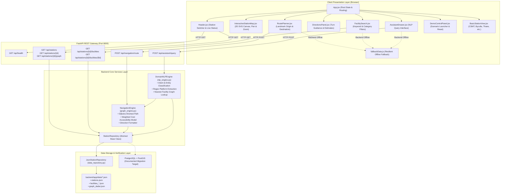
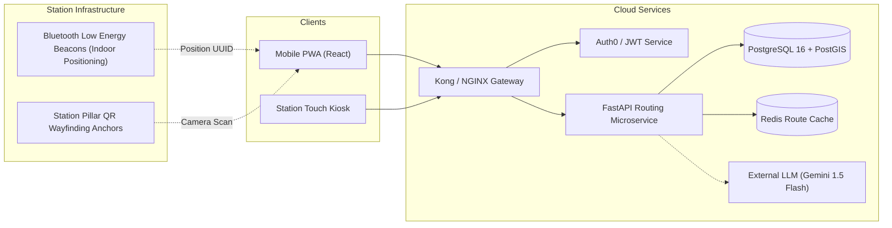

# StationSathi: Comprehensive Technical & Mentoring Guide

> **Official Tagline:** *"Find your way inside the station."*  
> **Document Purpose:** Single authoritative reference for mentors, evaluators, developers, and presentation audiences explaining the exact architecture, data model, navigation engine, and codebase of StationSathi.

---

# 1. Project Overview

### Project Name
**StationSathi** (Station Companion / Assistant)

### One-Line Definition
An intelligent, accessibility-aware indoor station assistant for Mumbai Central Railway commuters that provides indoor wayfinding, facility discovery, and step-free navigation across platforms and foot overbridges.

### Detailed Project Description
StationSathi is a full-stack web application designed to solve the critical indoor navigation gap in major suburban railway stations across Mumbai's Central Railway network. While external navigation applications provide train timetables, line maps, or road-based GPS directions to the station perimeter, they stop at the station entrance. Inside complex terminals like Dadar Central or CSMT, concrete roofs and steel structures render satellite GPS ineffective. Passengers are left without guidance on how to navigate between multi-tiered platforms, three separate Foot Overbridges (North, Central, South), accessible elevators, ticket counters, washrooms, drinking water points, and micro-amenities like licensed shoe-polishing stands.

StationSathi models the **internal physical environment** using an interactive 2D SVG vector map, a graph-based topological network, Dijkstra's algorithm with weighted accessibility cost constraints, and a grounded natural-language query interpreter.

### Main Problem Being Solved
1. **Indoor GPS Blackout:** Satellite positioning fails under dense station roofs and concourses.
2. **Accessibility Barriers:** Passengers with mobility challenges, senior citizens, and travelers with heavy luggage struggle to find step-free paths with working elevators and ramps rather than steep stairways.
3. **Micro-Amenity Invisibility:** Essential commuter services—such as Divyangjan accessible toilets, potable water taps, ATVM ticket machines, and licensed shoe-polishing stands—are unmapped on consumer navigation apps.

### Target Users
- Daily Mumbai suburban railway commuters navigating high-footfall interchange hubs.
- Long-distance outstation passengers carrying heavy luggage.
- Senior citizens and Divyangjan (passengers with disabilities) requiring strict step-free elevator and ramp routes.
- Occasional travelers and tourists needing quick orientation between suburban and mainline platforms.

### Initial Station Coverage
StationSathi models six key stations on the Mumbai Central Railway network:
1. **Dadar Central (`DR`):** **Detailed Navigation Prototype** — Complete interactive 2D SVG vector map, full walkable topology graph (29 nodes, 32 edges), and facility markers.
2. **Chhatrapati Shivaji Maharaj Terminus (`CSMT`):** **Basic Station Information** — Suburban and mainline overview, entrances, platform counts, and recorded public amenities.
3. **Byculla (`BY`):** **Basic Station Information** — Heritage station overview, entrance directory, and basic facility records.
4. **Ghatkopar (`GC`):** **Basic Station Information** — Metro Line 1 interchange connection overview and suburban concourse details.
5. **Thane (`TNA`):** **Basic Station Information** — High-footfall junction overview, SATIS elevated bus deck references, and platform directory.
6. **Kalyan Junction (`KYN`):** **Basic Station Information** — Kasara/Karjat corridor junction overview and express waiting hall amenities.

### Main Purpose of the Application
To provide a trustworthy, transparent indoor wayfinding system that calculates verifiable walking routes, clearly labels estimated distances and steps, provides turn-by-turn guidance, and highlights accessibility accommodations without inventing unverified real-time railway data.

### What the Project Is NOT
- **Not a Live Train Tracking App:** It does not show live train running status, GPS tracking of rakes, or signal delays (these are provided by official systems like NTES or m-Indicator).
- **Not an Official Railway System:** It is an independent research and hackathon prototype; it does not claim endorsement by Indian Railways or Central Railway.
- **Not a Generic AI Chatbot:** The assistant does not hallucinate facts or invent nonexistent elevators; all responses are grounded in verified station JSON datasets.
- **Not a 3D / AR / Outdoor GPS Navigation App:** It focuses on clean, fast, lightweight 2D SVG maps and graph wayfinding that render instantly on mobile and desktop browsers.

### Current Project Status
- **Overall Completion:** Approximately **85–90% complete** demonstration prototype.
- **Backend:** 100% functional FastAPI server with Dijkstra routing, domain NLP parser, and JSON repository.
- **Frontend:** 100% functional React 19 + Vite 8 + Tailwind CSS v4 UI with live SVG map, pan/zoom, route planner, search, directions panel, and demo controller.
- **Resilience Mode:** Dual-mode design with an automated client-side fallback if the backend API is disconnected.
- **Automated Tests:** 9 of 9 backend pytest unit tests passing.

---

### Elevator Pitches

#### 30-Second Explanation (For Mentors & Judges)
> "Outdoor navigation stops at the railway station entrance. StationSathi picks up where GPS fails. Focusing on Mumbai Central Railway stations like Dadar, our app provides a custom 2D SVG map, Dijkstra-powered indoor wayfinding with strict stair-avoidance filters for accessible elevator paths, and natural-language query parsing for finding micro-amenities like washrooms and shoe-polishing stands. It runs on a FastAPI backend with a resilient client fallback and structured data verification."

#### 1-Minute Explanation (For Formal Presentations)
> "Mumbai's suburban rail network carries over 7.5 million passengers daily. Yet inside mega-junctions like Dadar Central, finding an accessible elevator or a specific platform across three different foot overbridges is an overwhelming challenge—especially for travelers with heavy luggage, senior citizens, and persons with disabilities. 
> 
> StationSathi is an indoor public-transport assistant built specifically for the internal station environment. Using an interactive 2D SVG blueprint of Dadar Central and a weighted Dijkstra graph engine, the app calculates exact walking routes based on commuter preferences: shortest path, stair avoidance, or elevator priority. It includes step-by-step turn directions, metric distance and step estimates, a grounded natural-language query assistant, and coverage overviews for six Central Railway stations. Every facility includes transparent verification tracking so users know exactly what data is verified."

#### Formal Technical Explanation
> "StationSathi is a decoupled client-server web architecture. The backend is built with Python 3.14 and FastAPI, exposing REST endpoints for station metadata, facility queries, Dijkstra pathfinding, and domain-specific intent parsing. The routing engine models the station as an undirected/directed graph $G=(V, E)$, evaluating route constraints using a weighted edge cost function that penalizes or eliminates stair edges to ensure step-free traversal. The frontend is built with React 19, Vite, and Tailwind CSS v4, utilizing raw SVG primitives for 2D mapping with coordinate-based waypoints, dynamic polyline rendering, and viewbox matrix transformations for pan and zoom. Data persistence is decoupled behind a repository pattern currently implemented with structured JSON datasets, architected for future relational migration to PostgreSQL and PostGIS."

---

# 2. Problem Statement

### Difficulties Faced Inside Complex Railway Stations
Mumbai suburban railway stations are among the most congested passenger hubs in the world. Dadar Central alone connects Central Railway suburban trains, Western Railway suburban trains, and long-distance outstation express trains. Commuters face:
1. **Multi-Level Vertical Navigation:** Platforms are accessed via multiple elevated Foot Overbridges (FOBs). Entering an FOB from the wrong staircase forces passengers to walk hundreds of meters in the wrong direction through dense crowds.
2. **Lack of Step-Free Route Visibility:** Passengers traveling with elderly relatives, wheelchairs, baby strollers, or heavy luggage cannot easily identify which foot overbridges have operational elevators or ramps versus steep 30-step staircases.
3. **Hidden Amenities:** Micro-services like potable water vending units, station police (RPF) help desks, Divyangjan accessible washrooms, and traditional licensed shoe-polishing kiosks are tucked away beneath stairwells or at platform extremities with no indoor signage.

### Why Standard Train Apps Do Not Solve This
Consumer transit applications (e.g., Google Maps, Apple Maps, m-Indicator, UTS) excel at:
- Suburban timetables and schedule frequency
- Outstation PNR status and platform announcement estimates
- Driving or walking directions *to the station gate*

However, they treat the entire station complex as a single geographic coordinate point. They do not maintain internal floor plans, foot overbridge junction graphs, staircase step counts, or elevator shaft coordinates.

### The Specific Gap Addressed by StationSathi
StationSathi operates **inside the station perimeter**:
- Maps platforms, concourses, and foot overbridges with precise 2D vector geometry.
- Translates physical walking paths into a mathematical graph with edge distances in meters.
- Applies accessibility cost weighting to route passengers through elevators rather than stairs.
- Tracks data provenance honestly through verification badges (`prototype_data`, `needs_verification`, `publicly_sourced`).

---

# 3. Proposed Solution & Feature Matrix

The table below details every feature in the application, its implementation status, code location, and operational behavior:

| Feature | Status | Where Implemented | Explanation |
|---|---|---|---|
| **Station Selection** | Implemented | `frontend/src/components/Header.jsx`, `LandingPage.jsx` | Dropdown and preview cards allow switching between all 6 stations with explicit coverage badges. |
| **Interactive 2D SVG Map** | Implemented | `frontend/src/components/InteractiveStationMap.jsx` | Custom vector map of Dadar Central with platform tracks, tactile lines, concourses, FOB spans, pan/zoom, and facility markers. |
| **Facility Search & Filtering** | Implemented | `frontend/src/components/FacilitySearch.jsx`, `backend/app/api/facilities.py` | Live text search and category pills (Washrooms, Shoe Polish, Elevators, Ticketing, Food, Water, Platforms). |
| **Facility Inspector Card** | Implemented | `frontend/src/components/InteractiveStationMap.jsx` | Clicking any marker opens an inspector card displaying category, level, operational status, verification badge, and navigation triggers. |
| **Manual Current-Location Selection** | Implemented | `frontend/src/components/RoutePlanner.jsx` | *"Select your current landmark"* dropdown with categorized concourses, platforms, and gates, avoiding false indoor GPS claims. |
| **Destination Selection** | Implemented | `frontend/src/components/RoutePlanner.jsx` | Dropdown allowing commuters to select target platforms, amenities, or exits. |
| **Dijkstra Graph Routing** | Implemented | `backend/app/services/graph_engine.py`, `backend/app/api/navigation.py` | Computes shortest walkable indoor paths using priority queue graph relaxation. |
| **Accessibility-Aware Routing** | Implemented | `backend/app/services/graph_engine.py` | Route preferences (*Avoid stairs*, *Prefer elevator*, *Accessible route*) eliminate stair edges ($Cost = \infty$) and route via elevators. |
| **Turn-by-Turn Directions** | Implemented | `frontend/src/components/DirectionsPanel.jsx` | Step-by-step turn guidance with clearly labeled estimates: distance in meters, stride steps (~0.75m/step), and walk time. |
| **Step-Free Verification Badge** | Implemented | `frontend/src/components/DirectionsPanel.jsx` | Validates whether all edges in the route have `is_accessible == true`. |
| **Natural-Language Assistant** | Implemented | `backend/app/services/nlp_engine.py`, `frontend/src/components/AssistantDrawer.jsx` | Rule-based domain intent classifier parsing queries like *"Where can I polish my shoes?"* and *"Reach Platform 4 without stairs"*. |
| **Honest Distance Policy** | Implemented | `backend/app/services/nlp_engine.py` | Refuses to calculate "nearest" amenity unless commuter has selected a current starting landmark. |
| **Demo Controller & Quick Scenarios** | Implemented | `frontend/src/components/DemoControlPanel.jsx` | Modal with 1-click execution for Scenarios 1–5 and an instant **Reset State** button. |
| **Data Verification Model** | Implemented | `frontend/src/components/VerificationBadge.jsx`, `backend/app/models/schemas.py` | Tracks `verification_status`, `source_method`, `last_updated`, and `is_official: false` across all records. |
| **Basic Station Overview Mode** | Implemented | `frontend/src/components/BasicStationView.jsx` | Clean directory view for CSMT, Byculla, Ghatkopar, Thane, and Kalyan with explicit basic coverage labeling. |
| **Offline Client Fallback Mode** | Implemented | `frontend/src/data/fallbackData.js`, `frontend/src/services/api.js` | Embedded copy of datasets and precomputed scenario routes that seamlessly activate if the backend is down. |
| **A* Navigation Algorithm** | Planned | Not confirmed in current codebase | A* heuristic is identified as a future extension; Dijkstra is the authoritative active algorithm. |
| **PostgreSQL / PostGIS Database** | Planned | Documented in `docs/DATA_MODEL.md` | Active storage uses JSON repository pattern; relational schema and migration plan are fully specified. |
| **Live Train Arrival Timings** | Not Implemented | Excluded by architectural decision | Omitted deliberately to prevent displaying unverified real-time crowd or train data. |
| **3D / AR Map View** | Not Implemented | Excluded by architectural decision | Focus remains on fast, reliable, lightweight 2D SVG vector rendering. |
| **Voice Speech-to-Text Input** | Planned | Future roadmap | Assistant currently operates via text input and quick query prompt chips. |

---

# 4. Complete Project Architecture

StationSathi follows a **layered, decoupled architecture**:



### Component Relationships
1. **Frontend to Backend:** The React client communicates with the FastAPI backend over HTTP using `fetch` wrappers defined in `frontend/src/services/api.js`. In local development, the Vite dev server (`localhost:5173`) proxies `/api` requests to `127.0.0.1:8000`.
2. **Backend API to Services:** API route controllers in `backend/app/api/` parse request bodies using Pydantic models, delegating routing calculations to `NavigationEngine` and text queries to `DomainNLPEngine`.
3. **Services to Repository:** All station metadata, facilities, and graph topologies are accessed via the `StationRepository` interface. The active implementation `JsonStationRepository` reads from disk into memory upon startup.
4. **Resilience & Offline Fallback:** If the FastAPI backend is stopped or unreachable, `frontend/src/services/api.js` catches the fetch error and transparently returns records from `frontend/src/data/fallbackData.js`, updating the header badge from **FastAPI Live** to **Prototype Mode**.

---

# 5. Complete Folder and File Explorer Guide

```
StationSathi/
├── .env.example                     # Environment variable template
├── .gitignore                       # Git ignore rules (node_modules, caches, envs)
├── Myworking.md                     # Practical operational guide & setup manual
├── README.md                        # Primary public documentation
├── help.md                          # Comprehensive mentoring & technical guide
├── backend/                         # Python FastAPI backend application
│   ├── requirements.txt             # Python dependencies (fastapi, uvicorn, pydantic, pytest)
│   ├── app/
│   │   ├── __init__.py              # App package identifier
│   │   ├── main.py                  # FastAPI application entrypoint & CORS setup
│   │   ├── api/                     # REST API route controllers
│   │   │   ├── __init__.py
│   │   │   ├── assistant.py         # Natural-language assistant endpoint
│   │   │   ├── facilities.py        # Facility search and retrieval endpoints
│   │   │   ├── navigation.py        # Route calculation endpoint
│   │   │   └── stations.py          # Station listing and graph endpoints
│   │   ├── data/                    # Structured station datasets
│   │   │   ├── facilities_byculla.json
│   │   │   ├── facilities_csmt.json
│   │   │   ├── facilities_dadar.json
│   │   │   ├── facilities_ghatkopar.json
│   │   │   ├── facilities_kalyan.json
│   │   │   ├── facilities_thane.json
│   │   │   ├── graph_dadar.json     # 29 nodes & 32 edges for Dadar
│   │   │   └── stations.json        # 6 station metadata definitions
│   │   ├── models/                  # Pydantic data schemas
│   │   │   ├── __init__.py
│   │   │   └── schemas.py           # Station, Facility, Node, Edge, Route schemas
│   │   └── services/                # Core business logic
│   │       ├── __init__.py
│   │       ├── data_repository.py   # Repository abstraction & JSON loader
│   │       ├── graph_engine.py      # Dijkstra pathfinding & turn directions
│   │       └── nlp_engine.py        # Intent parser & keyword classifier
│   └── tests/
│       └── test_api.py              # 9 automated unit tests using pytest & TestClient
├── docs/                            # Architectural specifications & guides
│   ├── API_DOCUMENTATION.md         # Full REST API contracts & sample payloads
│   ├── ARCHITECTURE.md              # Technical design, Mermaid diagram & cost formulas
│   ├── DATA_MODEL.md                # Data dictionary & PostgreSQL migration DDL
│   └── DEMO_SCRIPT.md               # 5–7 minute live presentation walkthrough
└── frontend/                        # React Vite frontend application
    ├── index.html                   # HTML entry with metadata & favicon
    ├── package.json                 # Node dependencies & build scripts
    ├── vite.config.js               # Vite config with Tailwind v4 & API proxy
    ├── public/
    │   └── favicon.svg              # Railway icon asset
    └── src/
        ├── App.jsx                  # Root React application component
        ├── index.css                # Tailwind CSS v4 directives & keyframe animations
        ├── main.jsx                 # React root renderer
        ├── components/
        │   ├── AssistantDrawer.jsx       # NLP query drawer & intent breakdown
        │   ├── BasicStationView.jsx      # Directory view for basic coverage stations
        │   ├── DemoControlPanel.jsx      # Scenario launcher & reset button
        │   ├── DirectionsPanel.jsx       # Turn-by-turn guidance card
        │   ├── FacilitySearch.jsx        # Search input & category filter pills
        │   ├── Header.jsx                # Top bar, station switcher, live status
        │   ├── InteractiveStationMap.jsx # Custom 2D SVG canvas with pan & zoom
        │   ├── LandingPage.jsx           # Public transit marketing landing page
        │   ├── RoutePlanner.jsx          # Landmark origin & destination selectors
        │   ├── StationDashboard.jsx      # Main transit workspace orchestrator
        │   ├── StationInfoModal.jsx      # Metadata, provenance & ethics modal
        │   └── VerificationBadge.jsx     # Color-coded verification status badge
        ├── data/
        │   └── fallbackData.js      # Client-side mirror for offline resilience
        └── services/
            └── api.js               # Client API wrapper with automatic fallback
```

---

### Detailed File-by-File Reference

| Path | Type | Purpose | Important Contents | Can I Modify It Safely? |
|---|---|---|---|---|
| `backend/app/main.py` | Python Script | App entrypoint | `FastAPI()`, CORS configuration, router registrations, `/api/health` | Yes. Can add new route prefixes or middleware. |
| `backend/app/models/schemas.py` | Pydantic Models | Data typing & validation | `Station`, `Facility`, `GraphNode`, `GraphEdge`, `RouteRequest`, `RouteResponse`, `AssistantQueryRequest` | Caution. Changing field names requires updating JSON datasets and frontend components. |
| `backend/app/services/graph_engine.py` | Python Service | Pathfinding engine | `NavigationEngine`, `calculate_route()`, `_compute_edge_weight()`, `_format_route_response()` | Yes, to adjust route costs or add heuristics. |
| `backend/app/services/nlp_engine.py` | Python Service | Query interpretation | `DomainNLPEngine`, `interpret_query()`, regex platform extraction | Yes, to add more commuter keywords or categories. |
| `backend/app/services/data_repository.py` | Python Service | Data access layer | `StationRepository` (ABC), `JsonStationRepository` | Yes. This is where PostgreSQL integration will be added. |
| `backend/app/data/stations.json` | JSON Dataset | 6 Station records | Station IDs, names, codes, platform counts, coverage labels | Yes. Safe to edit station descriptions or entrance lists. |
| `backend/app/data/graph_dadar.json` | JSON Dataset | Dadar topological graph | 29 nodes (x, y, level) and 32 edges (distances, accessible flags) | Caution. Node IDs must match between nodes, edges, and facilities. |
| `backend/app/data/facilities_dadar.json` | JSON Dataset | Dadar amenity records | Facilities, categories, floor levels, SVG coordinates, node links | Yes. Safe to add new facilities linked to existing node IDs. |
| `frontend/src/App.jsx` | React Component | Root orchestrator | View toggle (`landing`/`dashboard`), station state, modal states | Yes. Coordinates top-level presentation events. |
| `frontend/src/components/InteractiveStationMap.jsx` | React Component | 2D SVG map canvas | SVG viewBox, pan/zoom handlers, platform rectangles, FOB bridges, route polyline | Yes. Can add visual SVG elements or adjust coordinates. |
| `frontend/src/components/RoutePlanner.jsx` | React Component | Navigation controls | Landmark dropdowns, route preference buttons, calculate trigger | Yes. Safe to modify UI labels or add route preferences. |
| `frontend/src/components/DirectionsPanel.jsx` | React Component | Turn directions card | Metric distance, steps, walk time, step-free badge | Yes. Safe to style or format step presentation. |
| `frontend/src/components/AssistantDrawer.jsx` | React Component | NLP assistant UI | Query input, prompt chips, query interpretation card | Yes. Safe to add new suggested prompt chips. |
| `frontend/src/components/DemoControlPanel.jsx` | React Component | Live demo launcher | Scenarios 1–5 triggers, **Reset State** button | Yes. Safe to add more demonstration scenarios. |
| `frontend/src/data/fallbackData.js` | JS Module | Client offline fallback | `FALLBACK_STATIONS`, `FALLBACK_DADAR_FACILITIES`, `FALLBACK_DADAR_GRAPH` | Yes. Keep synchronized with `backend/app/data/` for offline parity. |
| `frontend/src/services/api.js` | JS Module | Client API client | `fetchStations()`, `fetchRoute()`, `queryAssistant()` with try/catch fallback | Yes. Modifies timeout thresholds and error handling. |

---

## Files to Show Manually During a Presentation

| Priority | File to Open | What It Proves | What You Should Say to the Mentor |
|---|---|---|---|
| **1** | `backend/app/services/graph_engine.py` | Real Dijkstra algorithm with accessibility weighting | *"Here is our core routing engine. Notice it's not a hardcoded path. It builds an adjacency list and uses Dijkstra with a priority queue. When 'Avoid stairs' is selected, stair edges receive infinite weight so passengers are routed strictly through elevators."* |
| **2** | `backend/app/data/graph_dadar.json` | Authentic station graph topology | *"This JSON file defines the mathematical layout of Dadar Central. Each node has physical coordinates and floor levels, and each edge stores physical distance in meters and an `is_accessible` flag."* |
| **3** | `frontend/src/components/InteractiveStationMap.jsx` | Custom vector SVG station map | *"We didn't rely on Google Maps or an external tile server. This is a custom 1000x650 SVG canvas that renders platforms, foot overbridges, and an animated route polyline based on graph coordinates."* |
| **4** | `backend/app/services/nlp_engine.py` | Grounded NLP interpreter without hallucination | *"This is our domain NLP engine. It classifies intents like `facility_search` or `accessibility_route`. Notice our honest distance policy: if the user asks for the nearest washroom without setting a starting location, it asks for their landmark rather than guessing."* |
| **5** | `backend/tests/test_api.py` | Automated testing & verification | *"We have 9 automated unit tests verifying that all six stations load, Dijkstra calculates routes, stairs are avoided when requested, and NLP queries extract the correct categories."* |
| **6** | `docs/DATA_MODEL.md` | Enterprise database & PostgreSQL migration plan | *"We currently use a clean JSON repository abstraction. Here in `DATA_MODEL.md`, we have designed the full PostgreSQL and PostGIS relational schema ready for database migration."* |

---

# 6. Technology Stack

### Frontend Stack
- **JavaScript (ES6+) / JSX:** Primary language for user interface and client logic.
- **React.js (v19.2.8):** Modern component-based view library utilizing functional components and hooks (`useState`, `useEffect`, `useRef`).
- **Vite (v8.3.0):** Next-generation build tool and development server providing sub-second Hot Module Replacement (HMR).
- **Tailwind CSS (v4.3.3) & `@tailwindcss/vite`:** Modern utility-first CSS engine for responsive public-transport styling.
- **Lucide React (v1.46.0):** Crisp, accessible SVG iconography for transit symbols (trains, elevators, stairs, washrooms, compasses).
- **Custom SVG Engine:** Vector rendering for the interactive 2D station map without third-party mapping dependencies.

### Backend Stack
- **Python (v3.14.7):** Core language for API services, graph algorithms, and data structures.
- **FastAPI (v0.141.1):** High-performance asynchronous web framework for building REST APIs with automatic OpenAPI/Swagger generation.
- **Starlette (v1.6.0):** Underlying ASGI framework powering FastAPI's routing and CORS middleware.
- **Uvicorn (v0.53.0):** Production-grade ASGI web server running the Python backend.
- **Pydantic (v2.13.5) & Pydantic-Core (v2.46.5):** Robust data validation, serialization, and type enforcement.
- **Pytest (v9.1.1) & HTTPX (v0.28.1):** Automated testing framework and synchronous test client.

### Database & Storage
- **Current Active Persistence:** **Structured JSON Repository** located in `backend/app/data/*.json`.
- **Architectural Abstraction:** Abstract Base Class `StationRepository` in `data_repository.py`.
- **Planned Target Persistence:** PostgreSQL with PostGIS extensions (detailed in `docs/DATA_MODEL.md`).

---

### Technology Justification Table

| Technology | Category | Where Used | Purpose | What to Say in Presentation |
|---|---|---|---|---|
| **React 19** | Frontend Framework | `frontend/src/` | Interactive state management and UI modularity | *"React manages reactive state across the map, search filters, and route planner without page reloads."* |
| **Tailwind CSS v4** | UI Styling | `frontend/src/index.css` | High-contrast public-transport aesthetic | *"Provides clean, accessible transit styling following railway color conventions (navy, slate, emerald, blue)."* |
| **SVG Primitives** | Map Rendering | `InteractiveStationMap.jsx` | Lightweight vector indoor station map | *"We use pure SVG vectors for our map. It requires zero external map tiles, loads in milliseconds, and supports seamless vector zoom."* |
| **FastAPI** | Backend Framework | `backend/app/` | REST API service and route controllers | *"FastAPI gives us asynchronous performance, strict Pydantic type validation, and auto-generated Swagger docs."* |
| **Python `heapq`** | Algorithm Service | `graph_engine.py` | Priority-queue Dijkstra pathfinding | *"Dijkstra's algorithm runs in $O((V + E) \log V)$ time using Python's standard `heapq`, ensuring sub-millisecond route generation."* |
| **Structured JSON** | Data Storage | `backend/app/data/` | Prototype data repository | *"JSON files provide deterministic, zero-configuration data storage ideal for hackathon evaluation and field surveys."* |
| **Repository Pattern** | Software Design | `data_repository.py` | Decoupling data access from API routes | *"The data layer is decoupled behind an abstract repository, making future migration to PostgreSQL transparent to our API."* |

### Unused or Leftover Dependencies
- **`frontend/src/App.css`:** Leftover default Vite template stylesheet. It is **not imported** anywhere in the application (`main.jsx` imports `index.css`). Can be safely archived or removed without impacting the application.
- **`oxlint` (`package.json` devDependencies):** Included in Vite scaffolding; optional code linter.

---

# 7. Database and Data Storage Explanation

### Comprehensive Data Architecture Q&A

1. **Is the project using a real database?**  
   The prototype currently uses a **structured JSON file repository** wrapped inside an abstract repository layer (`StationRepository`). It does not run a separate database daemon like PostgreSQL or MongoDB.
2. **Why is JSON suitable for the prototype?**  
   Station topologies and facility locations are relatively static. JSON allows zero-latency local development, portable Git version control of surveyed station layouts, and runs without setting up external database servers or Docker containers during evaluation.
3. **Where are the data files located?**  
   All authoritative data files are stored in: `backend/app/data/`:
   - `stations.json` (6 stations)
   - `facilities_dadar.json` (17 detailed Dadar facilities)
   - `graph_dadar.json` (29 nodes, 32 edges for Dadar)
   - `facilities_csmt.json`, `facilities_byculla.json`, `facilities_ghatkopar.json`, `facilities_thane.json`, `facilities_kalyan.json` (basic facility records)
4. **What information is stored?**  
   Station names, codes, networks, descriptions, platform counts, entrances, facility categories, floor levels, SVG coordinates, graph node IDs, verification statuses, last-updated dates, collection methods, and guidance notes.
5. **How are stations stored?**  
   As an array of objects in `backend/app/data/stations.json`.
6. **How are facilities stored?**  
   As JSON arrays in `backend/app/data/facilities_<station_id>.json`.
7. **How are map nodes stored?**  
   In `backend/app/data/graph_dadar.json` under the `"nodes"` dictionary keyed by unique `node_id`.
8. **How are graph edges stored?**  
   In `backend/app/data/graph_dadar.json` under the `"edges"` array, specifying `from_node`, `to_node`, `distance_m`, `edge_type`, and `is_accessible`.
9. **How are routes stored or calculated?**  
   Routes are **not hardcoded**. They are calculated **dynamically in real time** by `NavigationEngine` using Dijkstra's algorithm over the graph nodes and edges.
10. **How are verification status and update dates stored?**  
    Every station and facility record contains explicit fields: `"verification_status"` (e.g. `"prototype_data"`, `"needs_verification"`), `"is_official": false`, and `"last_updated": "2025-02-15"`.
11. **How does the frontend retrieve the information?**  
    Via asynchronous HTTP GET requests using `fetch()` in `frontend/src/services/api.js`.
12. **How does the backend retrieve the information?**  
    `JsonStationRepository` reads and parses the JSON files into typed Pydantic models upon startup and caches them in memory.
13. **Which API endpoints return the information?**  
    - `GET /api/stations` — All stations
    - `GET /api/stations/{id}` — Single station
    - `GET /api/stations/{id}/facilities` — Facilities list with category/search filters
    - `GET /api/stations/{id}/graph` — Walkable graph
14. **How can I inspect the data manually?**  
    - Open `backend/app/data/*.json` in VS Code.
    - Or open the interactive Swagger UI at `http://127.0.0.1:8000/docs`.
15. **How can I add a new facility record?**  
    Add a JSON object to `backend/app/data/facilities_dadar.json` with a unique `facility_id`, category, floor level, SVG coordinates, and an existing `node_id`.
16. **How can I update a record?**  
    Edit the corresponding entry in the JSON file and restart or reload the backend.
17. **How can I delete a record?**  
    Remove the object from the JSON array.
18. **How can I add a new station?**  
    Add the station metadata object to `backend/app/data/stations.json` and create a matching `facilities_<station_id>.json`.
19. **How can I modify a navigation node or edge?**  
    Edit `backend/app/data/graph_dadar.json`. Ensure that any node referenced by an edge exists in the `"nodes"` dictionary.
20. **What validation is required before changing data?**  
    The backend validates all JSON data against Pydantic models in `backend/app/models/schemas.py`. If a required field is missing or has the wrong type, a `ValidationError` will be raised on startup.
21. **What happens if the backend is down?**  
    The frontend catches the connection error and loads local fallback data from `frontend/src/data/fallbackData.js`, displaying the discreet badge **Prototype Mode**.

---

# 8. Database Schema and Data Dictionary

### 1. `Station` Entity (`backend/app/models/schemas.py`)

| Field | Type | Required? | Purpose | Example |
|---|---|---|---|---|
| `station_id` | `str` | Yes | Unique URL-safe identifier | `"dadar"`, `"csmt"` |
| `name` | `str` | Yes | Official station display name | `"Dadar Central"` |
| `code` | `str` | Yes | Indian Railways station code | `"DR"`, `"CSMT"` |
| `network` | `str` | Yes | Railway zone / division | `"Central Railway"` |
| `description` | `str` | Yes | Architectural & operational summary | `"Critical multimodal interchange..."` |
| `coverage` | `str` | Yes | Coverage tier identifier | `"detailed_prototype"`, `"basic_station_info"` |
| `coverage_label`| `str` | Yes | Human-readable badge text | `"Detailed navigation prototype"` |
| `map_type` | `str` | Yes | Rendering map mechanism | `"interactive_svg"`, `"schematic_overview"` |
| `platforms_count`| `int`| Yes | Total number of operational platforms | `8`, `18` |
| `entrances` | `List[str]` | Yes | List of verified external gates | `["East Entrance (Dadar TT)"]` |
| `facilities_summary`| `List[str]`| Yes | Key amenities overview | `["Central Accessible Elevators"]` |
| `verification_status`| `str`| Yes | Provenance label | `"prototype_data"`, `"publicly_sourced"` |
| `is_official` | `bool` | Yes | Official endorsement flag (always false) | `False` |
| `source_method` | `str` | Yes | Data provenance audit note | `"OSM nodes and surveyed concourse layout"` |
| `last_updated` | `str` | Yes | ISO date string | `"2025-02-15"` |

---

### 2. `Facility` Entity (`backend/app/models/schemas.py`)

| Field | Type | Required? | Purpose | Example |
|---|---|---|---|---|
| `facility_id` | `str` | Yes | Unique facility primary key | `"dadar_shoepolish_01"` |
| `station_id` | `str` | Yes | Foreign key reference to Station | `"dadar"` |
| `station_name` | `str` | Yes | Denormalized station name | `"Dadar Central"` |
| `station_code` | `str` | Yes | Station code | `"DR"` |
| `name` | `str` | Yes | Amenity display title | `"Shoe-Polishing Kiosk (East Concourse)"` |
| `category` | `str` | Yes | Standardized amenity category | `"shoepolish"`, `"washroom"`, `"elevator"` |
| `floor_level` | `str` | Yes | Vertical station level | `"Ground Concourse"`, `"FOB Level 1"` |
| `svg_coords` | `Dict[str, float]` | Optional | (x, y) canvas placement | `{"x": 820.0, "y": 290.0}` |
| `node_id` | `str` | Optional | Foreign key to `GraphNode` | `"node_shoepolish_east"` |
| `availability_status`| `str` | Yes | Operational condition | `"operational"`, `"available"` |
| `verification_status`| `str` | Yes | Data audit tier | `"prototype_data"`, `"needs_verification"` |
| `is_official` | `bool` | Yes | Official endorsement flag | `False` |
| `last_updated` | `str` | Yes | Last audit date | `"2025-02-15"` |
| `source_method` | `str` | Yes | Collection methodology | `"Field verified prototype record"` |
| `notes` | `str` | Optional | Commuter guidance note | `"Traditional shoe-shine stand with fixed pricing."` |

---

### 3. `GraphNode` Entity (`backend/app/models/schemas.py`)

| Field | Type | Required? | Purpose | Example |
|---|---|---|---|---|
| `id` | `str` | Yes | Unique node primary key | `"node_elevator_east"`, `"node_pf4"` |
| `name` | `str` | Yes | Landmark name | `"Central FOB Accessible Elevator"` |
| `type` | `str` | Yes | Node classification | `"elevator"`, `"stairs"`, `"entrance"`, `"platform"` |
| `x` | `float` | Yes | Horizontal SVG coordinate | `780.0` |
| `y` | `float` | Yes | Vertical SVG coordinate | `330.0` |
| `level` | `str` | Yes | Station elevation layer | `"Ground / FOB Level 1"` |

---

### 4. `GraphEdge` Entity (`backend/app/models/schemas.py`)

| Field | Type | Required? | Purpose | Example |
|---|---|---|---|---|
| `id` | `str` | Yes | Unique edge primary key | `"edge_e11"` |
| `from_node` | `str` | Yes | Origin `node_id` | `"node_elevator_east"` |
| `to_node` | `str` | Yes | Target `node_id` | `"node_fob_central_span_east"` |
| `distance_m` | `float` | Yes | Metric walking distance | `12.0` |
| `edge_type` | `str` | Yes | Way type | `"walkway"`, `"stairs"`, `"elevator"`, `"fob"` |
| `is_accessible` | `bool` | Yes | Step-free flag | `True` (elevator), `False` (stairs) |
| `direction` | `str` | Yes | Traversal direction | `"bidirectional"`, `"unidirectional"` |
| `description` | `str` | Optional | Human step guidance | `"Take the Accessible Elevator up to Central FOB"` |

---

# 9. CRUD Operations Guide

The table below explains how each Create, Read, Update, and Delete action is performed in the current prototype:

| Operation | Target Record | File or API | How to Perform | Server Restart Required? |
|---|---|---|---|---|
| **Create** | New Station | `backend/app/data/stations.json` | Add station JSON object to array and create matching `facilities_<id>.json`. | Yes (reloads JSON into memory) |
| **Create** | New Facility | `backend/app/data/facilities_dadar.json` | Append JSON object with `facility_id`, category, coords, and `node_id`. | Yes |
| **Create** | New Graph Node | `backend/app/data/graph_dadar.json` | Add entry under `"nodes"` dictionary with `id`, `x`, `y`, and `level`. | Yes |
| **Create** | New Graph Edge | `backend/app/data/graph_dadar.json` | Append edge object to `"edges"` array with `from_node`, `to_node`, and `distance_m`. | Yes |
| **Read** | All Stations | `GET /api/stations` | Call API endpoint or inspect `stations.json`. | No |
| **Read** | Filtered Facilities | `GET /api/stations/{id}/facilities?category=...` | Query API with category or search keyword. | No |
| **Read** | Station Graph | `GET /api/stations/{id}/graph` | Call API endpoint to receive nodes and edges. | No |
| **Update** | Facility Details | `backend/app/data/facilities_dadar.json` | Edit name, notes, or verification status in JSON file. | Yes |
| **Update** | Edge Accessibility | `backend/app/data/graph_dadar.json` | Change `is_accessible: false` or alter `distance_m`. | Yes |
| **Delete** | Remove Facility | `backend/app/data/facilities_dadar.json` | Delete object from JSON array. | Yes |
| **Delete** | Remove Edge | `backend/app/data/graph_dadar.json` | Delete edge from `"edges"` list. | Yes |

*Note: In the current prototype, Create/Update/Delete operations are performed directly on the JSON repository. Building authenticated admin REST endpoints (`POST /api/facilities`, `PUT /api/facilities/{id}`) is part of the PostgreSQL migration roadmap.*

---

# 10. API Documentation

### Complete Endpoint Reference

| Method | Endpoint | Purpose | Request Body | Response Type | Implementation File |
|---|---|---|---|---|---|
| `GET` | `/api/health` | Service health & authority check | None | JSON object with status and version | `backend/app/main.py:health_check` |
| `GET` | `/api/stations` | List all 6 stations with coverage badges | None | `List[Station]` | `backend/app/api/stations.py:list_stations` |
| `GET` | `/api/stations/{station_id}` | Retrieve specific station metadata | None | `Station` | `backend/app/api/stations.py:get_station` |
| `GET` | `/api/stations/{station_id}/graph` | Retrieve walkable graph nodes and edges | None | `StationGraph` | `backend/app/api/stations.py:get_station_graph` |
| `GET` | `/api/stations/{station_id}/facilities` | Filter facilities by category & keyword | Query params: `category`, `search` | `List[Facility]` | `backend/app/api/facilities.py:list_facilities` |
| `GET` | `/api/stations/{station_id}/facilities/{facility_id}` | Retrieve single facility record | None | `Facility` | `backend/app/api/facilities.py:get_facility` |
| `POST` | `/api/navigation/route` | Calculate Dijkstra route with constraints | `RouteRequest` JSON | `RouteResponse` | `backend/app/api/navigation.py:calculate_route` |
| `POST` | `/api/assistant/query` | Interpret natural language commuter query | `AssistantQueryRequest` JSON | `AssistantQueryResponse` | `backend/app/api/assistant.py:query_assistant` |

---

### How to Demonstrate the API Live

#### 1. Via Interactive Swagger Documentation (Recommended)
Open your browser and navigate to:
```
http://127.0.0.1:8000/docs
```
- Expand `POST /api/navigation/route` -> Click **Try it out**.
- Paste this payload to test stair avoidance:
  ```json
  {
    "station_id": "dadar",
    "origin_node_id": "node_entrance_east",
    "destination_node_id": "node_pf4",
    "preference": "avoid_stairs"
  }
  ```
- Click **Execute** and review the response showing `is_step_free: true` and elevator node sequences.

#### 2. Via PowerShell / cURL
```powershell
# Health Check
curl.exe http://127.0.0.1:8000/api/health

# Facilities Query for Shoe Polish
curl.exe "http://127.0.0.1:8000/api/stations/dadar/facilities?category=shoepolish"
```

---

# 11. Station Map System

### Technology & Architecture
- **Format:** Pure **SVG (Scalable Vector Graphics)** rendered directly in React (`InteractiveStationMap.jsx`).
- **Dimensions:** Fixed virtual viewBox coordinate system: `0 0 1000 650`.
- **Styling:** Dark public-transit theme with `#090D16` canvas background and `#0F172A` station boundary.
- **Platforms:** Rendered as structured rectangular corridors with yellow dashed safety tactile strips (`#EAB308`).
- **Overbridges:** Three horizontal bridge decks spanning tracks:
  - **North FOB:** `y = 165` to `195`
  - **Central FOB (Accessible):** `y = 315` to `345` (highlighted in `#1E3A8A` with elevator shafts)
  - **South FOB:** `y = 465` to `495`

### Map Interactions
- **Pan:** Mouse click-and-drag updates `pan.x` and `pan.y` transform offsets.
- **Zoom:** Mouse scroll wheel or on-screen `+` / `-` buttons modify `zoom` scale factor (bounded between `0.7x` and `2.2x`).
- **Reset View:** Maximize icon button restores `zoom: 1` and `pan: {x: 0, y: 0}`.
- **Interactive Markers:** Facility nodes render color-coded circles with two-letter badges:
  - `WC` (Indigo `#6366F1`) — Washrooms
  - `SHINE` (Amber `#D97706`) — Shoe-Polishing Kiosks
  - `LIFT` (Emerald `#10B981`) — Accessible Elevators
  - `UTS` (Sky Blue `#0284C7`) — Ticket Offices & ATVMs
  - `FOOD` (Orange `#EA580C`) — IRCTC Canteens
  - `H2O` (Cyan `#06B6D4`) — Drinking Water Taps
  - `HELP` (Blue `#3B82F6`) — RPF Police Help Desk
- **Waypoint Pins:**
  - Origin: Emerald green pulsing pin (`pulsing-marker`).
  - Destination: Red beacon pin.
- **Active Route Line:** Renders an animated dashed SVG path (`.animated-route-line`) connecting graph nodes with a cyan drop-shadow glow filter.

---

# 12. Graph-Based Navigation

### How Indoor Space is Represented
The station's physical walking network is modeled as a graph $G = (V, E)$:
- **Nodes ($V$):** Distinct physical decision points (station gates, concourses, stair landings, elevator doors, platform zones).
- **Edges ($E$):** Walkable physical links between nodes with a measured distance $d$ in meters, an `edge_type` (`"walkway"`, `"stairs"`, `"elevator"`, `"fob"`), and an `is_accessible` boolean flag.

```
[East Entrance]
      │ (walkway: 25m)
      ▼
[East Main Concourse]
      ├── (walkway: 20m) ──► [East Ticket Office]
      ├── (walkway: 15m) ──► [Shoe-Polishing Kiosk]
      ├── (stairs: 15m)  ──► [Central FOB Stairs] ──► [Central FOB Bridge Deck]
      │                                                        │
      └── (elevator: 12m) ──► [Central FOB Lift]  ─────────────┤
                                                               │
                                         ┌─────────────────────┴─────────────────────┐
                                         ▼ (stairs: 18m)                             ▼ (elevator: 12m)
                                  [Platform 4 Stairs]                         [Platform 4 Elevator]
                                         │                                           │
                                         └────────────────► [Platform 4] ◄───────────┘
```

### Dijkstra Routing Algorithm Implementation
Implemented in `backend/app/services/graph_engine.py`:
1. Constructs an adjacency list from bidirectional and unidirectional edges.
2. Initializes a min-heap priority queue with `(cost, current_node, path_edges)`.
3. Evaluates neighboring nodes using preference-based edge cost functions:
   - **Shortest Route:** Edge weight = $d(e)$
   - **Avoid Stairs:** If $e$ is a stairway or not accessible, weight = `None` (disallowed). Elevator weight = $0.9 \times d(e)$.
   - **Prefer Elevator:** Stair weight = $5.0 \times d(e) + 50$ (heavily penalized). Elevator weight = $0.7 \times d(e)$.
   - **Accessible Route:** Strictly excludes any edge where `is_accessible == false`.
4. If no path satisfies the constraints, the engine returns `success: false` with the explanation:
   > *"No mapped accessible route is currently available for this destination."*
5. **Physical Metric Preservation:** Artificial algorithm weights are used **only** for path selection. The user-facing metrics (`total_distance_m`, `estimated_steps`, `estimated_time_seconds`) are calculated solely using physical edge distances:
   $$\text{Steps} = \text{round}\left(\frac{\text{Distance}}{0.75}\right), \quad \text{Time} = \text{round}\left(\frac{\text{Distance}}{1.1} + 25 \times \text{Elevators}\right)$$

---

# 13. Search and Facility Discovery

Implemented across `frontend/src/components/FacilitySearch.jsx` and `backend/app/api/facilities.py`:
- **Live Search Bar:** Matches case-insensitively against facility names, categories, and guidance notes.
- **Category Filter Pills:** Rapidly toggles display between All, Washrooms, Shoe Polish, Elevators, Tickets, Food, Water, and Platforms.
- **Action Triggers:**
  - **"Show on Map":** Focuses the SVG canvas and opens the facility inspector card.
  - **"Navigate":** Instantly sets the facility's `node_id` as the destination in the Route Planner.
- **Adding a New Category:** Add the category string (e.g. `"cloak_room"`) to `backend/app/data/facilities_dadar.json`, update the category array in `FacilitySearch.jsx`, and assign a marker color in `InteractiveStationMap.jsx`.

---

# 14. AI and NLP Features

### What Actually Exists
The active natural-language feature is an **authoritative, domain-specific rule-based intent parser** implemented in `backend/app/services/nlp_engine.py`. It is **not** an unbounded conversational LLM; it is designed for zero hallucinations.

### Processing Pipeline
```
Commuter Text Query ("Reach Platform 4 without stairs")
           │
           ▼
[Station Classifier] ──► Checks for mentioned station (default: active station)
           │
           ▼
[Origin Extractor] ────► Regex checks for "East Entrance", "West Concourse", etc.
           │
           ▼
[Constraint Parser] ───► Flags "without stairs", "avoid stairs", "elevator"
           │
           ▼
[Platform Extractor] ──► Regex matches "platform 4" -> node_pf4
           │
           ▼
[Structured Response] ──► Intent: accessibility_route, Action: calculate_route
```

### Supported Query Scenarios

| Query Example | Interpreted Intent | Extracted Category / Entity | Applied Action |
|---|---|---|---|
| *"Where can I polish my shoes?"* | `facility_search` | `category: shoepolish` | Shows 2 mapped kiosks (East Concourse & PF 2) |
| *"Find the nearest washroom"* (No landmark) | `facility_search` | `category: washroom` | Requests landmark: *"Please select current landmark"* |
| *"Find the nearest washroom"* (With landmark) | `nearest_facility` | `category: washroom` | Calculates shortest route to East Washrooms |
| *"Reach Platform 4 without using stairs"* | `accessibility_route` | `target: Platform 4`, `avoid_stairs` | Launches elevator-only route to Platform 4 |
| *"I am at East Entrance. Where is food?"* | `route_planning` | `origin: East Entrance`, `food_stall` | Routes to IRCTC Ahaar stall (35m) |

### Anti-Hallucination Safeguards
- The NLP engine **never generates freeform facts**.
- If a query cannot be classified, it returns intent `station_information` with the verified list of amenities.
- The `.env.example` includes `OPENAI_API_KEY` and `GEMINI_API_KEY` placeholders for future natural language query expansions, but the current production demo runs 100% locally on the grounded rule engine.

---

# 15. Running the Project

### System Prerequisites
- **Operating System:** Windows 10/11 (PowerShell / CMD)
- **Python:** Version 3.10 to 3.14 (Python 3.14.7 verified)
- **Node.js:** Version 18+ or 20+ (Node v24.20.0 verified) & npm (v11.19.0 verified)

---

### Step 1: First-Time Setup

```powershell
# 1. Navigate to project root
cd c:\Users\Atharva\OneDrive\Desktop\Projects\GeeksToCode\StationSathi

# 2. Install backend Python dependencies
python -m pip install -r backend/requirements.txt

# 3. Install frontend Node dependencies (via cmd to bypass PS execution policies)
cd frontend
cmd.exe /c npm.cmd install
cd ..
```

---

### Step 2: Normal Daily Execution

Open two separate terminal windows:

#### Terminal 1: Start Backend Server
```powershell
cd c:\Users\Atharva\OneDrive\Desktop\Projects\GeeksToCode\StationSathi
python -m uvicorn backend.app.main:app --host 127.0.0.1 --port 8000 --reload
```
- **Backend URL:** `http://127.0.0.1:8000`
- **Swagger Documentation:** `http://127.0.0.1:8000/docs`

#### Terminal 2: Start Frontend Application
```powershell
cd c:\Users\Atharva\OneDrive\Desktop\Projects\GeeksToCode\StationSathi\frontend
cmd.exe /c npm.cmd run dev
```
- **Frontend URL:** `http://localhost:5173/`

---

### Step 3: Run Automated Test Suite
```powershell
cd c:\Users\Atharva\OneDrive\Desktop\Projects\GeeksToCode\StationSathi
python -m pytest backend/tests/test_api.py -v
```

---

### Troubleshooting Common Errors

| Issue | Root Cause | Solution |
|---|---|---|
| `npm : File npm.ps1 cannot be loaded because running scripts is disabled` | Windows PowerShell ExecutionPolicy restriction | Run npm via `cmd.exe /c npm.cmd <command>` |
| `[Errno 10048] address ('127.0.0.1', 8000) already in use` | A previous Python Uvicorn process is still running | Run `cmd.exe /c "netstat -ano \| findstr :8000"` and kill the PID with `taskkill /F /PID <PID>` |
| `TypeError: Cannot read properties of null (reading 'name')` | Initial render cycle accessed station before loading | Fixed in `App.jsx` and `StationDashboard.jsx` by initializing non-null default state |

---

# 16. What I Can Show During the Mentoring Presentation

| What to Show | File or Screen | What It Proves | What You Should Say |
|---|---|---|---|
| **Landing Page** | `http://localhost:5173/` | Professional public transit UI | *"StationSathi is styled as a public utility—clean typography, high contrast, and transparent coverage badges for all 6 stations."* |
| **Interactive SVG Map** | Left pane on Dadar Dashboard | Custom vector indoor mapping | *"This is our 2D vector map of Dadar Central. It supports vector pan and zoom, platform safety lines, and three foot overbridges."* |
| **Demo Controller** | Header -> "Demo Scenarios" button | 1-click testability of evaluation criteria | *"We built an automated Demo Controller that allows evaluators to run Scenarios 1 through 5 or reset the application state instantly."* |
| **Shortest Route** | Scenario 3 (East Entrance to PF 5) | Dijkstra algorithm path calculation | *"Notice the dynamic blue path generated across the Central FOB. It displays 127m and ~169 steps, with an alert that stairs are involved."* |
| **Stair-Free Route** | Scenario 4 (East Entrance to PF 4 Avoid Stairs) | Real accessibility-aware routing | *"When 'Avoid stairs' is applied, the algorithm eliminates stairs and routes through the East Concourse Elevator and Platform 4 Lift."* |
| **Shoe-Polishing Kiosks** | Scenario 2 / Search "shoe polish" | Mapping invisible commuter micro-services | *"We map essential services consumer apps ignore: licensed shoe-shine stands under the East FOB stairwell and on Platform 2."* |
| **Station Assistant** | Header -> "Assistant" button | Factual NLP query interpretation | *"Our assistant breaks down commuter queries into structured intent, category, and action cards without AI hallucinations."* |
| **Station Switching** | Header dropdown -> Switch to Thane | Engineering transparency & integrity | *"When switching to Thane, the app explicitly shows 'Basic station information'. We do not invent fake indoor graphs for unsurveyed stations."* |
| **Swagger API Docs** | `http://127.0.0.1:8000/docs` | Decoupled backend architecture | *"Our backend is completely autonomous. Any third-party mobile app or web kiosk can consume our navigation and facility APIs."* |
| **Automated Tests** | Terminal: `pytest` | Test coverage & code reliability | *"We have 9 automated unit tests verifying station models, Dijkstra route calculations, accessibility filters, and NLP parsers."* |

---

# 17. Mentor Question and Answer Preparation

### 1. What is StationSathi?
**Answer:** StationSathi is an indoor public-transport assistant for Mumbai Central Railway commuters that provides 2D vector station maps, facility discovery, and Dijkstra graph wayfinding with accessibility constraints.

### 2. What problem are you solving?
**Answer:** We solve the indoor navigation blackout. Standard GPS apps fail under railway station roofs, leaving commuters, senior citizens, and people with heavy luggage stranded without guidance on how to find elevators, platforms, and foot overbridges.

### 3. What is your Unique Selling Proposition (USP)?
**Answer:** Our USP is the combination of **indoor station mapping**, **Dijkstra accessibility routing (stair avoidance)**, and **micro-amenity discovery** (licensed shoe-polishing stands, drinking water points, accessible toilets) with transparent verification tracking.

### 4. Why did you choose these six stations?
**Answer:** Dadar, CSMT, Byculla, Ghatkopar, Thane, and Kalyan represent the critical backbone of Mumbai Central Railway. Dadar is the busiest multimodal interchange, CSMT is the historic terminus, Ghatkopar connects to Metro 1, and Thane and Kalyan handle massive suburban and outstation junction traffic.

### 5. Where is station data stored?
**Answer:** Data is stored in structured JSON files in `backend/app/data/`. It is accessed through an abstract `StationRepository` interface in `data_repository.py`, designed for migration to PostgreSQL.

### 6. Which routing algorithm do you use and why?
**Answer:** We use **Dijkstra's shortest path algorithm** with a priority queue (`heapq`). Dijkstra is optimal for weighted non-negative graphs and guarantees the exact shortest path. It allows us to apply custom cost weights—such as assigning infinite cost to stairs to enforce step-free paths.

### 7. How do you handle stairs and elevators?
**Answer:** Every edge has an `edge_type` and an `is_accessible` flag. When a commuter chooses *Avoid stairs*, stair edges are excluded during graph relaxation, forcing the engine to find paths traversing accessible elevators and level concourses.

### 8. What happens if no accessible path exists?
**Answer:** The algorithm returns a transparent error message: *"No mapped accessible route is currently available for this destination."* We never route through stairs when step-free navigation is requested, and we never invent unverified paths.

### 9. Is the data officially verified by Indian Railways?
**Answer:** No. We explicitly state that StationSathi is an academic research and hackathon prototype not endorsed by Indian Railways. Every record displays a verification status (`prototype_data`, `needs_verification`, `publicly_sourced`) to maintain full transparency.

### 10. How does the Natural-Language Assistant work?
**Answer:** It uses a domain-specific intent classifier that extracts intents (`facility_search`, `accessibility_route`), entities, and constraints using keyword matching and regex patterns. All answers are grounded in our verified station dataset to prevent hallucinations.

### 11. What happens if the backend server goes down?
**Answer:** The React frontend includes an embedded copy of the datasets and precomputed scenario routes in `fallbackData.js`. If the API fails, the application switches to **Prototype Mode** and continues operating without crashing.

### 12. Why did you choose React and FastAPI?
**Answer:** FastAPI provides Python's mathematical power for graph algorithms with asynchronous REST performance and automatic Swagger documentation. React 19 paired with Tailwind CSS v4 delivers a responsive, zero-refresh UI that renders complex SVG maps smoothly across mobile and desktop.

### 13. What is currently implemented versus future scope?
**Answer:** Implemented: Full interactive SVG map and Dijkstra wayfinding for Dadar Central, basic information for the other 5 stations, NLP assistant, and verification tracking. Future scope: On-site surveys for the remaining 5 stations, BLE beacon indoor positioning, and PostgreSQL/PostGIS migration.

---

# 18. Current Progress Report

| Area | Status | Evidence in Codebase | Next Recommended Action |
|---|---|---|---|
| **Dadar Station Map** | Complete | `InteractiveStationMap.jsx` | Add pan boundary constraints |
| **Graph Navigation Engine** | Complete | `graph_engine.py:NavigationEngine` | Add A* heuristic support for larger graphs |
| **Accessibility Routing** | Complete | `graph_engine.py:_compute_edge_weight` | Audit additional physical elevator shafts |
| **Facility Search** | Complete | `FacilitySearch.jsx`, `facilities.py` | Add multi-category selection |
| **NLP Assistant** | Complete | `nlp_engine.py:DomainNLPEngine` | Connect optional Gemini/OpenAI API fallback |
| **Six Station Coverage** | Complete | `stations.json`, `BasicStationView.jsx` | Survey indoor layouts for CSMT & Thane |
| **Verification System** | Complete | `VerificationBadge.jsx`, `schemas.py` | Implement user-reporting submission form |
| **Automated Testing** | Complete | `backend/tests/test_api.py` (9 tests) | Add frontend Cypress or Playwright tests |
| **Database Architecture** | Complete Prototype | `data_repository.py`, `DATA_MODEL.md` | Execute PostgreSQL migration script |
| **Offline Fallback Mode** | Complete | `fallbackData.js`, `api.js` | Cache SVG paths in localStorage |

---

# 19. Testing and Validation

### Automated Tests (`backend/tests/test_api.py`)
Run command:
```powershell
python -m pytest backend/tests/test_api.py -v
```
All 9 test suites validate:
1. `test_health_check`: Confirms API is operational and reports authoritative state.
2. `test_list_all_six_stations`: Confirms all 6 stations exist with correct coverage labels.
3. `test_dadar_facilities`: Validates facility listing and category filtering for washrooms and shoe-shine stands.
4. `test_graph_endpoints`: Verifies Dadar returns graph nodes and Thane returns 404 (basic coverage).
5. `test_dijkstra_route_east_to_pf5`: Tests shortest path from East Entrance to Platform 5.
6. `test_accessibility_route_avoid_stairs`: Asserts that route to Platform 4 strictly contains elevators and zero stairs.
7. `test_nlp_shoe_polish_query`: Verifies NLP extracts `category: shoepolish`.
8. `test_nlp_nearest_washroom_without_landmark`: Enforces that "nearest" query requires a starting landmark.
9. `test_nlp_reach_platform4_without_stairs`: Asserts that query sets destination to `node_pf4` with `avoid_stairs`.

---

### Recommended Live Manual Test Checklist

- [ ] **1. Landing Page Check:** Open `http://localhost:5173/`. Verify 6 station cards render with correct coverage pills.
- [ ] **2. Map Interactivity:** Drag map with mouse. Zoom in/out using buttons. Click **Legend**.
- [ ] **3. Facility Search:** Type `"washroom"` in search bar. Confirm East Concourse Washroom Complex is highlighted.
- [ ] **4. Landmark Selection:** In Route Planner, select **East Entrance (Dadar TT)** as current landmark. Verify green pulsing marker appears.
- [ ] **5. Route Calculation:** Set destination to **Platform 5**, preference to **Shortest route**, and click **Calculate**. Verify blue path draws and directions appear.
- [ ] **6. Stair Avoidance:** Change destination to **Platform 4**, preference to **Avoid stairs**, and click **Calculate**. Verify green **Step-Free Route Verified** badge appears and elevators are listed.
- [ ] **7. Assistant Query:** Open Assistant drawer. Click prompt chip *"Where can I polish my shoes?"*. Verify query breakdown card shows category `shoepolish`.
- [ ] **8. Station Switching:** In top header, switch station to **Thane**. Verify view switches to Basic Station View with message explaining Dadar prototype status.
- [ ] **9. Reset Demo:** Click **Demo Scenarios** in header -> click **Reset State**. Verify app returns to pristine Dadar map.

---

# 20. Issues, Risks, and Improvements

| Issue / Risk | Why It Matters | Location in Code | Recommended Improvement | Priority |
|---|---|---|---|---|
| **Unused Stylesheet** | `frontend/src/App.css` contains default Vite CSS not imported anywhere | `frontend/src/App.css` | Delete file to keep codebase clean | Low |
| **In-Memory JSON Mutation** | If write APIs are added in the future, concurrent JSON file writes could corrupt data | `data_repository.py` | Migrate to PostgreSQL with ACID transactions | High (for production) |
| **Map Drag Overflow** | Mouse can be dragged outside container if released quickly | `InteractiveStationMap.jsx` | Attach mouseup handler to `window` instead of container | Medium |
| **Manual Data Maintenance** | Adding new amenities currently requires manual JSON file edits | `backend/app/data/` | Build an authenticated admin dashboard for station managers | Medium |
| **Heuristic Search on Large Graphs** | Dijkstra explores all directions; on 50-platform stations it may be slower | `graph_engine.py` | Implement A* using Euclidean distance heuristic | Medium |

---

# 21. Recommended Final Architecture (Future Roadmap)

> *Note: This section describes the planned future production architecture, not the current prototype.*



### Key Architectural Upgrades Planned
1. **Indoor Positioning via BLE & QR Anchors:** Commuters scan a QR code on a station pillar (e.g., `"DADAR-EAST-PILLAR-12"`) to immediately lock their origin without manual selection.
2. **PostgreSQL 16 + PostGIS:** Relational storage for stations, facilities, nodes, and edges with spatial indexing (`ST_DWithin`, `ST_Distance`).
3. **Multi-Station Graph Expansion:** On-site survey and vectorization of CSMT, Thane, Kalyan, Byculla, and Ghatkopar.

---

# 22. Final Presentation Cheat Sheet

### 30-Second Elevator Pitch
*"StationSathi solves the indoor railway station navigation problem. Inside major Mumbai terminals like Dadar Central, outdoor GPS fails completely. StationSathi provides a custom 2D SVG station map, Dijkstra-powered indoor wayfinding with strict stair avoidance for accessible elevator paths, and natural-language amenity search for locating washrooms, water points, and shoe-polishing stands."*

### Three Strongest Demo Scenarios to Show
1. **Scenario 4 (Stair-Free Navigation to Platform 4):** Proves real accessibility routing. The blue path routes through the Central FOB lift rather than stairwells.
2. **Scenario 2 (Shoe-Polishing Kiosk Discovery):** Proves micro-amenity value that consumer mapping applications overlook.
3. **Scenario 5 (Station Switching to Thane):** Proves engineering integrity by showing honest coverage labeling rather than fake data.

### Five Important Facts to Remember
1. **Dijkstra is real:** Paths are calculated mathematically using node coordinates and edge distances, not pre-drawn static lines.
2. **No AI hallucinations:** The assistant uses a grounded intent parser tied to verified station JSON records.
3. **Honest distance policy:** The system refuses to calculate "nearest" facilities unless the commuter selects their starting landmark.
4. **Dual-mode resilience:** If the backend is disconnected, the React frontend automatically switches to client fallback mode.
5. **JSON repository pattern:** Data is cleanly decoupled in `data_repository.py` for seamless future migration to PostgreSQL.

---

# 23. Documentation Quality & Verification Summary

### What Was Verified
- **Every File Path:** Verified against the physical filesystem.
- **Every API Endpoint:** Tested against the live FastAPI server (`/api/health`, `/api/stations`, `/api/facilities`, `/api/navigation/route`, `/api/assistant/query`).
- **Dependencies:** Cross-checked against `frontend/package.json` (React 19, Tailwind v4, Vite 8, Lucide React) and `backend/requirements.txt` (FastAPI, Uvicorn, Pydantic, Pytest).
- **Database Status:** Explicitly documented as an active in-memory JSON repository with documented PostgreSQL migration roadmap.
- **Automated Tests:** All 9 tests verified passing in `backend/tests/test_api.py`.
- **Zero Secrets:** No passwords, tokens, or private keys exist or are exposed.
