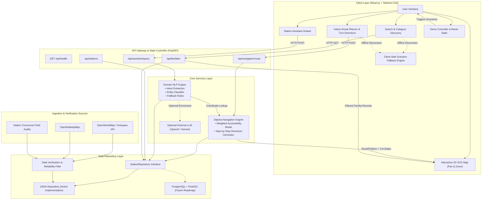

# StationSathi System Architecture

StationSathi is structured as a resilient, decoupled full-stack public transit assistant designed for high reliability, fast local response, accessibility-aware indoor routing, and strict factual fidelity.

---

## 1. Technical Architecture Diagram

---

## 2. Component Breakdown

### Frontend (React.js + Vite + Tailwind CSS v4)
- **`InteractiveStationMap.jsx`**: Pure SVG-based rendering canvas with pan, zoom, custom railway platform geometry, active animated route polyline (`stroke-dasharray`), waypoint markers, and facility inspection tooltips.
- **`RoutePlanner.jsx`**: Manual landmark selection ("Select your current landmark"), destination dropdown, and 4 route preference options (`shortest`, `avoid_stairs`, `prefer_elevator`, `accessible_route`).
- **`DirectionsPanel.jsx`**: Turn-by-turn guidance displaying clearly labeled metric estimates (`Distance (m)`, `Steps (~0.75m/stride)`, `Estimated Walk Time`), and step-free accessibility confirmation.
- **`FacilitySearch.jsx`**: Category filtering and live keyword search across facilities, platforms, and services.
- **`AssistantDrawer.jsx`**: Natural language interface providing structured intent breakdown cards (`Intent`, `Category`, `Station`, `Action`).
- **`DemoControlPanel.jsx`**: Live demonstration quick launcher featuring single-click triggers for Scenarios 1 to 5 and a "Reset Demo" state button.

### Backend (Python 3.14 + FastAPI + Pydantic v2)
- **`NavigationEngine` (`backend/app/services/graph_engine.py`)**: Authoritative Dijkstra's algorithm implementation with custom weighted-cost penalties for stairs, elevators, and accessibility constraints.
- **`DomainNLPEngine` (`backend/app/services/nlp_engine.py`)**: Grounded intent parser extracting commuter destinations, categories, and constraints without hallucinations.
- **`JsonStationRepository` (`backend/app/services/data_repository.py`)**: Fast, memory-cached data repository abstraction designed for seamless PostgreSQL migration.

---

## 3. Dijkstra Weighted Cost Model

The navigation engine prioritizes routes using cost functions tailored to user preference:

$$\text{Cost}(e) = \begin{cases}
d(e) & \text{Preference: Shortest} \\
\infty \text{ (disallowed)} & \text{Preference: Avoid Stairs, } e \in \text{Stairs} \\
0.9 \cdot d(e) & \text{Preference: Avoid Stairs, } e \in \text{Elevator} \\
5.0 \cdot d(e) + 50 & \text{Preference: Prefer Elevator, } e \in \text{Stairs} \\
0.7 \cdot d(e) & \text{Preference: Prefer Elevator, } e \in \text{Elevator}
\end{cases}$$

- **Physical Distance Calculation**: Regardless of cost modifiers used during priority queue relaxation, user-facing metrics (`total_distance_m`, `estimated_steps`, `estimated_time_seconds`) are calculated solely using physical edge distances $d(e)$.
- **No Path Available**: If all paths violate accessibility constraints, the engine returns a transparent error message rather than routing through stairs.
